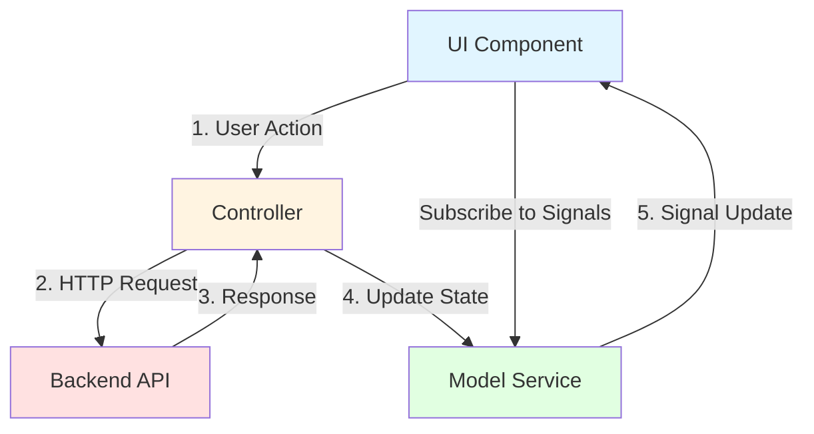

# Controller and Model Design Pattern

## Overview

The Angular frontend follows a unidirectional data flow pattern using a **Controller-Model-View** architecture. This pattern separates concerns and provides a clear flow of data through the application.

## Architecture Components

### 1. **Model Service** (`model.service.ts`)
The Model Service is the single source of truth for application state. It:
- Stores data using Angular signals (writable signals internally)
- Exposes readonly signals to components
- Provides setter methods to update the state
- Does NOT communicate with the backend directly

### 2. **Controller** (`controller.ts`)
The Controller orchestrates write operations and backend communication. It:
- Handles all HTTP requests to the backend
- Processes responses and errors
- Updates the Model Service with new data
- Provides methods for CRUD operations

### 3. **UI Components**
Components consume data and trigger actions. They:
- Subscribe to signals from the Model Service to display data
- Use `effect()` to react to signal changes
- Call Controller methods to perform write operations
- Do NOT make HTTP calls directly

## Data Flow



## Detailed Flow

1. **User Action**: User interacts with the UI (e.g., clicks "Create Demo Item")
2. **Controller Invocation**: Component calls a Controller method (e.g., `controller.createDemo()`)
3. **Backend Communication**: Controller makes HTTP request to the backend
4. **Response Processing**: Controller receives response or error
5. **Model Update**: Controller updates Model Service with new data (e.g., `modelService.setDemos(demos)`)
6. **Signal Emission**: Model Service updates its signals
7. **UI Reaction**: Components automatically re-render based on signal changes

## Example: Demo CRUD Operations

### Model Service
```typescript
@Injectable({ providedIn: 'root' })
export class ModelService {
  private demos = signal<Demo[]>([]);
  demos$: Signal<Demo[]> = this.demos.asReadonly();
  
  setDemos(demos: Demo[]) {
    this.demos.set(demos);
  }
}
```

### Controller
```typescript
@Injectable({ providedIn: 'root' })
export class Controller {
  private modelService = inject(ModelService);
  private http = inject(HttpClient);
  
  loadDemos() {
    this.http.get<Demo[]>('/api/demo').subscribe({
      next: (demos) => this.modelService.setDemos(demos),
      error: (err) => console.error('Error loading demos:', err)
    });
  }
  
  async createDemo(): Promise<Demo> {
    const demo = await firstValueFrom(
      this.http.post<Demo>('/api/demo', {})
    );
    this.loadDemos(); // Refresh the list
    return demo;
  }
}
```

### Component
```typescript
@Component({ ... })
export class DemoComponent implements OnInit {
  private modelService = inject(ModelService);
  private controller = inject(Controller);
  
  demos: Signal<Demo[]> = this.modelService.demos$;
  
  ngOnInit() {
    this.controller.loadDemos();
  }
  
  async onCreate() {
    await this.controller.createDemo();
    // UI automatically updates via signal
  }
}
```

## Benefits

1. **Separation of Concerns**: Clear boundaries between data, logic, and presentation
2. **Testability**: Easy to mock Controller and Model Service in tests
3. **Predictable State**: Single source of truth prevents state inconsistencies
4. **Reactive UI**: Signals automatically trigger UI updates
5. **Maintainability**: Changes to backend communication only affect Controller

## Best Practices

1. **Never bypass the pattern**: Components should not make HTTP calls directly
2. **Keep Model Service pure**: No business logic or HTTP calls in Model Service
3. **Controller handles errors**: Process and log errors before updating Model
4. **Use readonly signals**: Prevent components from directly mutating state
5. **Reload after mutations**: After create/update/delete, reload data to ensure consistency

## Anti-Patterns to Avoid

❌ **Don't**: Make HTTP calls directly in components
❌ **Don't**: Put business logic in Model Service
❌ **Don't**: Expose writable signals to components
❌ **Don't**: Skip the Controller for backend operations
❌ **Don't**: Manually trigger change detection (signals handle this)

## Comparison with NgRx and Similar State Management Frameworks

### NgRx / Redux Pattern
NgRx follows a strict unidirectional data flow with:
- **Actions**: Dispatched events (e.g., `LoadDemosAction`, `CreateDemoSuccessAction`)
- **Reducers**: Pure functions that update state based on actions
- **Effects**: Handle side effects like HTTP calls
- **Selectors**: Query slices of state
- **Store**: Centralized immutable state container

### Key Differences

| Aspect | Controller-Model Pattern | NgRx |
|--------|-------------------------|------|
| **Method Names** | Business-focused (`loadDemos()`, `createDemo()`) | Technical/generic (`dispatch()`, action types) |
| **Complexity** | Lightweight, minimal boilerplate | Heavy boilerplate (actions, reducers, effects, selectors) |
| **Learning Curve** | Shallow - familiar OOP patterns | Steep - requires understanding Redux principles |
| **State Updates** | Direct method calls on services | Dispatch actions, reducers process |
| **Side Effects** | Handled directly in Controller | Separate Effects layer |
| **Type Safety** | TypeScript methods and interfaces | Action types, discriminated unions |
| **Debugging** | Standard debugging, console logs | Redux DevTools, time-travel debugging |
| **Testability** | Mock services with Jasmine spies | Mock store, actions, reducers separately |

### Business-Focused API

The Controller-Model pattern allows you to create **domain-specific methods** that clearly express business intent:

```typescript
// Controller-Model Pattern - Clear business intent
controller.createDemo()
controller.deleteDemo(id)
controller.loadDemos()

// NgRx - Technical dispatch pattern
store.dispatch(DemoActions.createDemo())
store.dispatch(DemoActions.deleteDemo({ id }))
store.dispatch(DemoActions.loadDemos())
```

This makes the code more readable and self-documenting, especially for developers who are not familiar with Redux patterns.

## Advantages of Controller-Model Pattern

### ✅ Advantages

1. **Business-Focused API**: Methods are named after business operations, not technical actions
   - `controller.createDemo()` vs `store.dispatch(CreateDemoAction())`
   - Easier for domain experts and new developers to understand

2. **Minimal Boilerplate**: No need for actions, reducers, effects, or selectors
   - Faster development velocity
   - Less code to maintain and test

3. **Familiar OOP Patterns**: Uses standard service injection and method calls
   - Lower learning curve for developers new to Angular
   - No need to learn Redux/Flux architecture

4. **Direct Method Calls**: Simple, synchronous-looking code with async/await
   - Easier to follow the flow of execution
   - Standard error handling with try/catch

5. **Lightweight**: No additional dependencies beyond Angular core
   - Smaller bundle size
   - Fewer breaking changes from third-party libraries

6. **Flexible**: Easy to add custom logic without fighting the framework
   - No strict rules about pure functions or immutability
   - Can mix imperative and reactive styles as needed

7. **Good Enough for Most Apps**: Sufficient for small to medium applications
   - Avoids over-engineering for simple use cases
   - Can always migrate to NgRx later if needed

### ❌ Disadvantages

1. **No Time-Travel Debugging**: Cannot replay actions or inspect state history
   - Harder to debug complex state transitions
   - No built-in DevTools integration

2. **Less Structured**: No enforced patterns for state updates
   - Developers can bypass the pattern more easily
   - Requires discipline to maintain consistency

3. **Limited Scalability**: Can become unwieldy in very large applications
   - Controller can grow too large with many operations
   - No built-in way to split state into feature modules

4. **No Action History**: Cannot see what actions led to current state
   - Harder to understand how the application reached a particular state
   - No audit trail of state changes

5. **Manual State Management**: No automatic optimizations like memoization
   - Selectors in NgRx automatically memoize computed values
   - May need to implement caching manually

6. **Less Testable State Logic**: State updates are scattered across Controller methods
   - NgRx reducers are pure functions, easier to test in isolation
   - Controller tests require mocking HTTP and Model Service

7. **No Middleware**: Cannot easily intercept and log all state changes
   - NgRx meta-reducers allow global state interceptors
   - Harder to implement cross-cutting concerns like logging

8. **Implicit Dependencies**: Components depend on specific Controller methods
   - NgRx actions are more decoupled from components
   - Harder to refactor without breaking components

## When to Use Each Pattern

### Use Controller-Model Pattern When:
- Building small to medium-sized applications
- Team is not familiar with Redux/Flux patterns
- Development speed is more important than advanced debugging
- State management needs are straightforward
- You want to minimize dependencies and bundle size

### Use NgRx When:
- Building large, complex applications with many state interactions
- Need time-travel debugging and advanced DevTools
- Team is experienced with Redux patterns
- Require strict state management discipline
- Need to audit all state changes
- Building a long-lived application that will grow significantly

## Conclusion

The Controller-Model pattern is a pragmatic choice for applications that need reactive state management without the complexity of full Redux-style architecture. It provides a **business-focused API** that is easier to understand and maintain, at the cost of advanced debugging features and strict architectural guarantees. For many applications, this trade-off is worthwhile.
