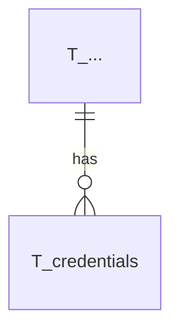

# Database Model Documentation

## Overview

TODO: _get the LLM to generate this_

TODO describe the data model.

The schema is compatible with both MySQL and H2 databases and follows a naming convention where all tables are prefixed with `T_`, foreign keys with `FK_`, and indices with `I_`.

## Entity Relationship Diagram



## Table Descriptions

### TODO one of these paragraphs per table

The `T_TODO` table stores ...

**Important:** TODO if there is anything important, add it here...

**Key Features:**
- TODO

**Constraints:**
- `I_TODO`: Unique constraint on TODO field

**Status Values:**
- `TODO`: a line per status, if the field contains status

**Indices:**
- `I_TODO`: describe indices here

**Relationships:**
- TODO Links to client via `client_id` (not enforced FK for flexibility)
- TODO Links to account via `account_id` after user authentication
- TODO ---

**Security Features:**
- TODO if there are any...

**Default Data:**
- TODO if there is any

## Naming Conventions

The database follows strict naming conventions for consistency and clarity:

- **Tables**: Prefixed with `T_` (e.g., `T_accounts`, `T_oauth_clients`)
- **Foreign Keys**: Format `FK_<tableName>_<columnName>` (e.g., `FK_credentials_account_id`)
- **Indices**: Format `I_<tableName>_<columnName(s)>` (e.g., `I_accounts_email`)
- **Primary Keys**: Always named `id` using VARCHAR(36) for UUID storage
- **Timestamps**: Use `created_at` and `expires_at` naming pattern

## Data Flow

TODO describe it here.

## Database Compatibility

The schema is designed to work with both MySQL and H2 databases:

- Uses standard SQL data types
- Avoids database-specific features
- Named constraints for explicit control
- Separate CREATE INDEX statements for compatibility
- BOOLEAN type supported by both databases
- VARCHAR lengths within common limits

## Indexes and Performance

Strategic indexes are placed for common query patterns:

- **Unique Indexes**: Enforce business rules (email, username, client_id, code)
- **Composite Indexes**: Support multi-column queries (client_id + account_id)
- **Expiration Indexes**: Enable efficient cleanup of expired records
- **Foreign Key Indexes**: Implicit indexes on FK columns for join performance

## Security Considerations

- **Password Storage**: Only hashed passwords stored, never plaintext
- **Expiration**: All temporary entities have expiration timestamps
- **Cascade Deletes**: Automatic cleanup of related records
- **One-Time Codes**: Authorization codes can only be used once

## Maintenance

### Cleanup Queries

Expired records should be periodically cleaned:

TODO describe the queries here. e.g.:
```sql
-- Clean expired authorization requests
DELETE FROM T_authorization_requests 
WHERE expires_at < CURRENT_TIMESTAMP;

### Monitoring Queries

TODO describe them here, e.g.:
```sql
-- Check for locked accounts
SELECT a.email, c.locked_until, c.failed_login_attempts
FROM T_accounts a
JOIN T_credentials c ON a.id = c.account_id
WHERE c.locked_until > CURRENT_TIMESTAMP;
```

