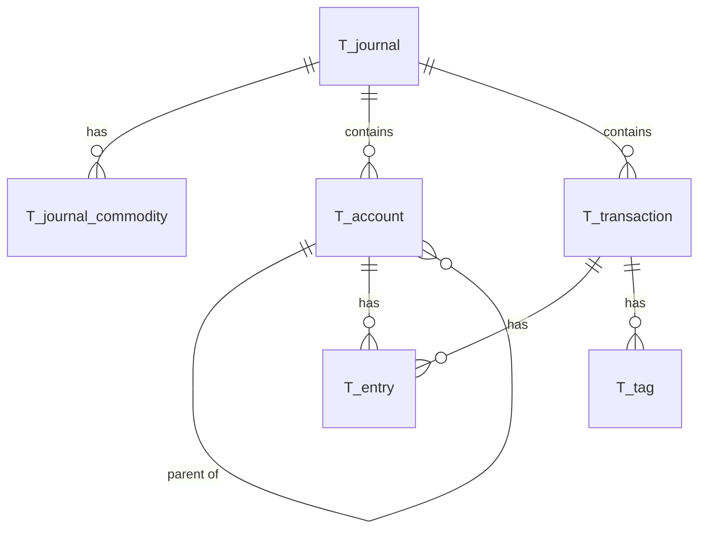

# Database Model Documentation

## Overview

This database implements a double-entry accounting system with support for multiple journals, accounts, transactions, and reporting. The schema is compatible with both MySQL and H2 databases and follows a naming convention where all tables are prefixed with `T_`, foreign keys with `FK_`, and indices with `I_`.

The system supports:
- Multi-currency accounting with configurable commodity display precision
- Hierarchical account structures with parent-child relationships
- Transaction templates (macros) for common accounting operations
- Flexible reporting with customizable report templates
- Transaction tagging for categorization and filtering
- Partner tracking for customer/supplier relationships

## Entity Relationship Diagram


```mermaid
erDiagram
    T_journal ||--o{ T_journal_commodity : "has"
    T_journal ||--o{ T_account : "contains"
    T_journal ||--o{ T_transaction : "contains"
    T_account ||--o{ T_account : "parent of"
    T_account ||--o{ T_entry : "has"
    T_transaction ||--o{ T_entry : "has"
    T_transaction ||--o{ T_tag : "has"
```

## Table Descriptions

### T_journal

The `T_journal` table stores journal metadata including title, logo, and default currency. Each journal represents a separate set of books (e.g., for different companies or accounting periods).

**Key Features:**
- Supports multiple commodities/currencies per journal
- Configurable display precision for each commodity
- Logo and subtitle for branding/identification

**Columns:**
- `id` (VARCHAR(36)): Primary key, UUID
- `logo` (VARCHAR(500)): URL or path to journal logo
- `title` (VARCHAR(500)): Journal title
- `subtitle` (VARCHAR(500)): Journal subtitle
- `currency` (VARCHAR(10)): Default currency code (e.g., CHF, USD)

**Relationships:**
- Has many commodities via `T_journal_commodity`
- Has many accounts via `T_account`
- Has many transactions via `T_transaction`

### T_journal_commodity

The `T_journal_commodity` table defines commodities/currencies used in a journal with their display precision.

**Columns:**
- `journal_id` (VARCHAR(36)): Foreign key to T_journal
- `commodity_code` (VARCHAR(10)): Commodity/currency code (e.g., CHF, USD, BTC)
- `display_precision` (VARCHAR(20)): Display precision for amounts

**Constraints:**
- Primary key: (`journal_id`, `commodity_code`)
- `FK_journal_commodity_journal`: Foreign key to T_journal with CASCADE delete

**Indices:**
- `I_journal_commodity`: Index on (`journal_id`, `commodity_code`)

### T_account

The `T_account` table stores chart of accounts with support for hierarchical structures.

**Key Features:**
- Hierarchical account structure via `parent_account_id`
- Account type classification (CASH, ASSET, LIABILITY, EQUITY, REVENUE, EXPENSE)
- Optional ordering for import/display purposes

**Columns:**
- `id` (VARCHAR(36)): Primary key, UUID
- `account_name` (VARCHAR(500)): Account name/description
- `type` (VARCHAR(20)): Account type enum
- `note` (VARCHAR(1000)): Optional notes
- `parent_account_id` (VARCHAR(36)): Parent account for hierarchical structure
- `journal_id` (VARCHAR(36)): Foreign key to journal
- `account_order` (INT): Optional ordering field

**Account Types:**
- `CASH`: Cash and cash equivalents
- `ASSET`: Assets
- `LIABILITY`: Liabilities
- `EQUITY`: Equity/capital
- `REVENUE`: Revenue/income
- `EXPENSE`: Expenses

**Constraints:**
- `FK_account_journal`: Foreign key to T_journal with CASCADE delete
- `FK_account_parent`: Foreign key to T_account (self-reference) with CASCADE delete

**Indices:**
- `I_account_name`: Index on account_name for searching
- `I_account_journal`: Index on journal_id for filtering
- `I_account_parent`: Index on parent_account_id for hierarchy queries

### T_transaction

The `T_transaction` table stores transaction headers with date, status, and partner information.

**Key Features:**
- Transaction status tracking (PENDING, CLEARED, RECONCILED)
- Partner tracking for customer/supplier relationships
- Optional business transaction identifier

**Columns:**
- `id` (VARCHAR(36)): Primary key, UUID
- `transaction_date` (DATE): Transaction date
- `status` (VARCHAR(20)): Transaction status enum
- `description` (VARCHAR(1000)): Transaction description
- `partner_id` (VARCHAR(100)): Partner identifier (customer/supplier)
- `transaction_id` (VARCHAR(100)): Business transaction identifier (e.g., invoice number)
- `journal_id` (VARCHAR(36)): Foreign key to journal

**Status Values:**
- `PENDING`: Transaction entered but not yet cleared
- `CLEARED`: Transaction cleared/posted
- `RECONCILED`: Transaction reconciled with bank statement

**Constraints:**
- `FK_transaction_journal`: Foreign key to T_journal with CASCADE delete

**Indices:**
- `I_transaction_date`: Index on transaction_date for date range queries
- `I_transaction_partner`: Index on partner_id for partner reports
- `I_transaction_journal`: Index on journal_id for filtering
- `I_transaction_transaction_id`: Index on transaction_id for lookup

**Relationships:**
- Has many entries via `T_entry`
- Has many tags via `T_tag`

### T_entry

The `T_entry` table stores individual journal entries (debits and credits) for each transaction.

**Key Features:**
- Double-entry accounting with positive/negative amounts
- Multi-currency support via commodity field
- Entry ordering for display consistency
- Precision: DECIMAL(19, 4) for accurate financial calculations

**Columns:**
- `id` (VARCHAR(36)): Primary key, UUID
- `transaction_id` (VARCHAR(36)): Foreign key to transaction
- `account_id` (VARCHAR(36)): Foreign key to account
- `commodity` (VARCHAR(10)): Currency/commodity code
- `amount` (DECIMAL(19, 4)): Entry amount (positive for debit, negative for credit)
- `note` (VARCHAR(1000)): Optional entry-level notes
- `entry_order` (INT): Display order within transaction

**Constraints:**
- `FK_entry_transaction`: Foreign key to T_transaction with CASCADE delete
- `FK_entry_account`: Foreign key to T_account with CASCADE delete

**Indices:**
- `I_entry_account`: Index on account_id for account queries
- `I_entry_transaction`: Index on transaction_id for transaction loading

### T_tag

The `T_tag` table stores key-value tags for categorizing and filtering transactions.

**Key Features:**
- Flexible key-value tagging system
- Multiple tags per transaction
- Supports filtering and reporting by tag

**Columns:**
- `id` (VARCHAR(36)): Primary key, UUID
- `transaction_id` (VARCHAR(36)): Foreign key to transaction
- `tag_key` (VARCHAR(255)): Tag key/name
- `tag_value` (VARCHAR(500)): Tag value

**Constraints:**
- `FK_tag_transaction`: Foreign key to T_transaction with CASCADE delete

**Indices:**
- `I_tag_transaction`: Index on transaction_id for transaction loading
- `I_tag_tag_key`: Index on tag_key for filtering by tag type

**Common Tag Keys:**
- `invoice`: Invoice number reference
- `Payment`: Payment indicator
- `YearEnd`: Year-end closing entries
- `TaxProvision`, `Depreciation`, `InventoryAdjustment`: Specific transaction types

### T_report_template

The `T_report_template` table stores report definitions for generating financial statements.

**Key Features:**
- JSON-based template content for flexible report definitions
- Supports balance sheets, income statements, trial balances, and custom reports
- Timestamp tracking for audit trail

**Columns:**
- `id` (VARCHAR(255)): Primary key, report template identifier
- `name` (VARCHAR(255)): Report name
- `description` (TEXT): Report description
- `template_content` (TEXT): JSON template definition
- `created_at` (TIMESTAMP): Creation timestamp
- `updated_at` (TIMESTAMP): Last update timestamp (auto-updated)

**Default Data:**
The system includes several pre-configured report templates:
- `balance-sheet-001`: Standard balance sheet
- `income-statement-001`: Profit and loss statement
- `trial-balance-001`: Trial balance with debits/credits
- `swiss-balance-sheet-001`: Swiss SME format balance sheet
- `swiss-income-statement-001`: Swiss SME format income statement
- `partner-report-001`: Partner activity report

### T_macro

The `T_macro` table stores transaction templates for common accounting operations.

**Key Features:**
- Parameterized transaction templates
- JSON-based parameter definitions
- Validation rules for data integrity
- Independent of journals (can be used across all journals)

**Columns:**
- `id` (VARCHAR(36)): Primary key, UUID
- `name` (VARCHAR(100)): Macro name
- `description` (VARCHAR(500)): Macro description
- `parameters` (TEXT): JSON parameter definitions
- `template` (TEXT): Transaction template with placeholders
- `validation` (TEXT): JSON validation rules
- `notes` (TEXT): Usage notes and examples
- `created_date` (TIMESTAMP): Creation timestamp
- `modified_date` (TIMESTAMP): Last modification timestamp

**Indices:**
- `I_macro_name`: Index on name for searching

**Default Data:**
The system includes standard accounting macros:
- `PaymentByStaff`: Staff expense reimbursement
- `RepayStaff`: Staff reimbursement payment
- `BankingExpense`: Bank fees and charges
- `PayInvoiceFromBank`: Supplier invoice payment
- `PaymentForGoods`: Inventory purchase
- `InvoiceForServicesOrSaas`: Customer invoicing
- `CustomerPaysInvoice`: Customer payment receipt
- `InventoryAdjustment`: Year-end inventory write-down
- `RecordDepreciation`: Fixed asset depreciation
- `TaxProvision`: Year-end tax provision
- `TaxPayment`: Tax payment with adjustment
- `LegalReserveAllocation`: Swiss legal reserve allocation (mandatory for Sàrl)

## Naming Conventions

The database follows strict naming conventions for consistency and clarity:

- **Tables**: Prefixed with `T_` (e.g., `T_journal`, `T_account`)
- **Foreign Keys**: Format `FK_<tableName>_<columnName>` (e.g., `FK_account_journal`)
- **Indices**: Format `I_<tableName>_<columnName(s)>` (e.g., `I_account_name`)
- **Primary Keys**: Always named `id` using VARCHAR(36) for UUID storage
- **Timestamps**: Use `created_at`/`updated_at` or `created_date`/`modified_date` naming pattern
- **Column Names**: Use snake_case (e.g., `account_name`, `parent_account_id`)

## Data Flow

1. **Journal Setup**: Create a journal with title, currency, and commodity definitions
2. **Account Creation**: Define chart of accounts with hierarchical structure and types
3. **Transaction Entry**: Create transactions with entries that balance to zero
4. **Tagging**: Add tags to transactions for categorization
5. **Reporting**: Generate reports using templates that aggregate entry data

**Double-Entry Accounting Rules:**
- Each transaction must have at least two entries
- Sum of all entry amounts in a transaction must equal zero
- Positive amounts represent debits, negative amounts represent credits
- Account types determine normal balance (debit or credit)

## Database Compatibility

The schema is designed to work with both MySQL and H2 databases:

- Uses standard SQL data types
- Avoids database-specific features
- Named constraints for explicit control
- Separate CREATE INDEX statements for compatibility
- VARCHAR lengths within common limits
- DECIMAL(19, 4) for precise financial calculations
- TEXT type for large content (templates, JSON)
- TIMESTAMP with DEFAULT CURRENT_TIMESTAMP and ON UPDATE CURRENT_TIMESTAMP

## Indexes and Performance

Strategic indexes are placed for common query patterns:

- **Foreign Key Indexes**: All foreign key columns are indexed for join performance
- **Search Indexes**: Account names and tag keys for filtering
- **Date Indexes**: Transaction dates for date range queries
- **Partner Indexes**: Partner IDs for customer/supplier reports
- **Composite Indexes**: Journal commodity lookup

## Cascade Delete Behavior

The schema uses CASCADE deletes to maintain referential integrity:

- Deleting a journal cascades to all accounts, transactions, and commodities
- Deleting an account cascades to all child accounts and entries
- Deleting a transaction cascades to all entries and tags
- This ensures no orphaned records remain in the database

## Maintenance

### Balance Verification

Verify that all transactions balance to zero:

```sql
-- Find unbalanced transactions
SELECT t.id, t.transaction_date, t.description, SUM(e.amount) as balance
FROM T_transaction t
JOIN T_entry e ON t.id = e.transaction_id
GROUP BY t.id, t.transaction_date, t.description
HAVING ABS(SUM(e.amount)) > 0.0001;
```

### Account Balance Queries

Calculate account balances:

```sql
-- Account balances for a specific journal
SELECT a.account_name, a.type, SUM(e.amount) as balance
FROM T_account a
LEFT JOIN T_entry e ON a.id = e.account_id
WHERE a.journal_id = ?
GROUP BY a.id, a.account_name, a.type
ORDER BY a.account_name;
```

### Partner Activity

Analyze partner transactions:

```sql
-- Partner transaction summary
SELECT t.partner_id, 
       COUNT(*) as transaction_count,
       SUM(CASE WHEN e.amount > 0 THEN e.amount ELSE 0 END) as total_debits,
       SUM(CASE WHEN e.amount < 0 THEN ABS(e.amount) ELSE 0 END) as total_credits
FROM T_transaction t
JOIN T_entry e ON t.id = e.transaction_id
WHERE t.journal_id = ?
GROUP BY t.partner_id
ORDER BY transaction_count DESC;
```
