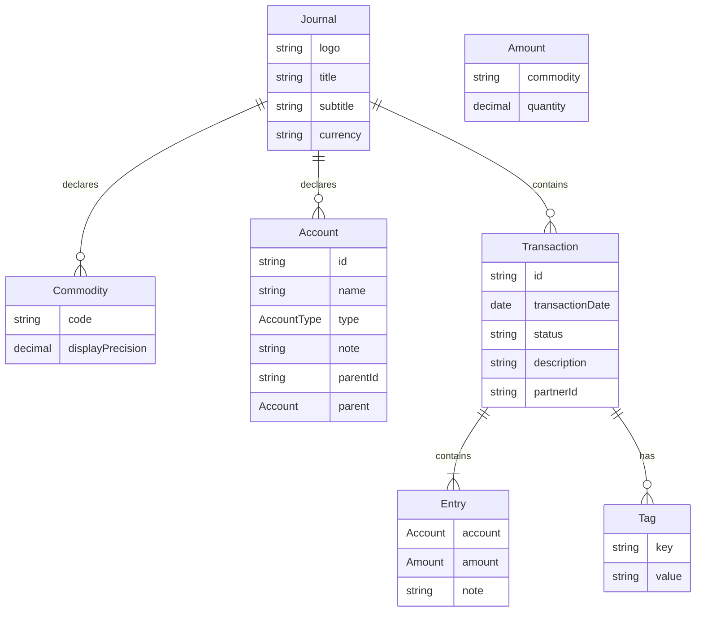
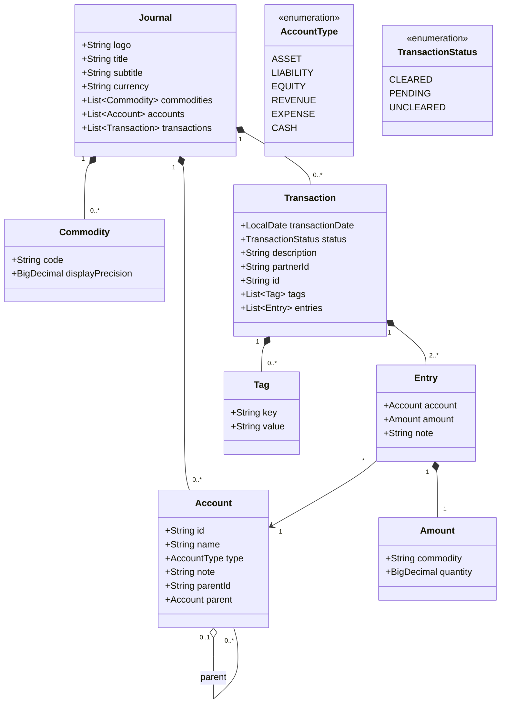

# Data Model for Plain Text Accounting Journal

## Overview

This document describes the data model for a plain text accounting journal format, based on a subset of features from plain text accounting applications. The format supports:

- Journal metadata (logo, title, subtitle, currency)
- Commodity declarations
- Account declarations with hierarchical structure and type annotations
- Transactions with entries
- Tags and metadata on transactions and entries

## Entity Relationship Diagram



## Core Entities

### Journal

The root entity representing the entire journal file.

**Attributes:**
- `logo`: URL to company logo
- `title`: Company name and registration details
- `subtitle`: Company address and contact information
- `currency`: Default currency code (e.g., "CHF")
- `commodities`: List of commodity declarations
- `accounts`: List of account declarations
- `transactions`: List of transactions

### Commodity

Represents a currency or commodity with display formatting rules.

**Attributes:**
- `code`: Commodity code (e.g., "CHF", "USD")
- `displayPrecision`: Decimal precision for display (e.g., 1000.00 means 2 decimal places)

**Example:**
```
commodity CHF 1000.00
```

### Account

Represents an account in the chart of accounts with hierarchical structure.

**Attributes:**
- `id`: Account identifier/number (e.g., "1", "10", "100", "1000")
- `name`: Account name (e.g., "Assets", "Current Assets", "Cash")
- `type`: Account type enumeration
- `note`: Optional descriptive note
- `parentId`: ID of parent account
- `parent`: Reference to parent account (derived from hierarchy)

**Account Type Enumeration:**
- `Asset`: Assets owned by the company
- `Liability`: Obligations owed by the company
- `Equity`: Owner's claims on assets
- `Revenue`: Income from operations
- `Expense`: Costs of operations
- `Cash`: Special type for cash flow reporting

**Hierarchy:**
Accounts use `:` as separator for hierarchy levels. The account number prefix indicates the level.

### Transaction

Represents a financial transaction with multiple entries.

**Attributes:**
- `transactionDate`: Date of the transaction
- `status`: Transaction status (`*` for cleared, `!` for pending, empty for uncleared)
- `description`: Transaction description
- `partnerId`: Optional partner identifier (extracted from description after `|` separator)
- `id`: Optional UUID for unique identification
- `tags`: List of tags (key-value pairs)
- `entries`: List of entries (must balance to zero)

**Special Tags:**
- `:OpeningBalances:`: Marks opening balance transactions
- `:Closing:`: Marks closing/adjustment transactions
- `:Payment:`: Marks payment transactions
- `invoice`: References an invoice ID

### Entry

Represents a single line in a transaction affecting one account.

**Attributes:**
- `account`: Reference to the account being affected
- `amount`: Amount with commodity
- `note`: Optional note for this entry

**Balance Rule:**
All entries in a transaction must sum to zero for each commodity.

### Amount

Represents a monetary amount with its commodity.

**Attributes:**
- `commodity`: Commodity code (e.g., "CHF")
- `quantity`: Decimal amount (positive or negative)

### Tag

Represents metadata attached to transactions or entries.

**Attributes:**
- `key`: Tag key (e.g., "id", "invoice")
- `value`: Tag value (e.g., "bcba9da2-81be-4a78-b4a3-fbd856ad7dde")

**Format:**
- Simple tags: `:TagName:`
- Key-value tags: `key:value`

## Class Diagram



## File Format Syntax

### Comments

Lines starting with `;` are comments and can contain metadata directives.

```
; This is a comment
; key: value
```

### Commodity Declaration

```
commodity <CODE> <DISPLAY_FORMAT>
```

Example:
```
commodity CHF 1000.00
```

### Account Declaration

```
account <ACCOUNT_NUMBER> <ACCOUNT_NAME>
  ; type:<TYPE>
  ; note:<NOTE>
```

Example:
```
account 1 Actifs / Assets
  ; type:Asset
  ; note:This group includes all accounts related to what the company owns
```

### Transaction

```
<DATE> <STATUS> <DESCRIPTION>
    ; <TAG>
    ; <KEY>:<VALUE>
    <ACCOUNT>    <COMMODITY> <AMOUNT>
    <ACCOUNT>    <COMMODITY> <AMOUNT>
    ...
```

Example:
```
2025-01-04 * P00000007 Hoststar | hoststar invoice domain name
    ; id:bcba9da2-81be-4a78-b4a3-fbd856ad7dde
    ; invoice:PI00000017
    6 Autres Charges    CHF 1.60
    2 Passif / Liabilities    CHF -1.60
```

### Special Entry: Ellipsis

The `...` entry indicates that the amount should be automatically calculated to balance the transaction.

## Validation Rules

1. **Transaction Balance**: All entries in a transaction must sum to zero for each commodity
2. **Account Hierarchy**: Child accounts must reference valid parent accounts
3. **Commodity Consistency**: All amounts must reference declared commodities
4. **Date Format**: Dates must be in ISO format (YYYY-MM-DD)
5. **Account References**: All entries must reference declared accounts
6. **Unique IDs**: Transaction IDs (when provided) should be unique

## Implementation Notes

### Parsing Considerations

1. **Whitespace**: Account names and amounts are separated by significant whitespace (typically multiple spaces or tabs)
2. **Line Continuation**: Transactions span multiple lines; entries are indented
3. **Hierarchy Parsing**: Account hierarchy is determined by the `:` separator in account names
4. **Tag Parsing**: Tags can appear on transaction lines or entry lines, prefixed with `;`

### Storage Considerations

1. **Account Hierarchy**: Can be stored as a tree structure or with parent references
2. **Decimal Precision**: Use `BigDecimal` for monetary amounts to avoid floating-point errors
3. **Indexing**: Consider indexing by transaction date, account, and transaction ID
4. **Validation**: Implement validation at parse time and before persistence

## Future Extensions

While not currently implemented, the model could be extended to support:

- Multiple currencies per transaction with exchange rates
- Budget declarations
- Price declarations for commodities
- Automated transaction rules
- Virtual/calculated entries
- Balance assertions
