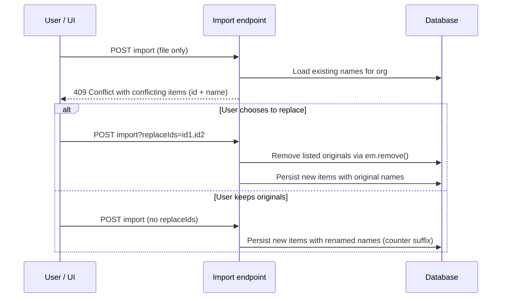

# Macro and Report Template Import/Export

## Goal

Provide batch import/export for two independent artefact types:

- **Macros** (`T_macro`) — reusable transaction templates.
- **Report templates** (`T_report_template`) — dynamic report definitions.

They are imported/exported separately: a user can export only macros, only reports, or both in two separate operations. The file format is human-editable so that users can modify the file between export and import.

## Scope

- Macros and report templates are **organisation-scoped** via Hibernate `@TenantId` (`org_id`).
- Import creates the artefacts in the caller's current organisation.
- Export returns only the artefacts that belong to the caller's current organisation.
- The existing [`JournalResource.uploadJournal()`](src/main/java/dev/abstratium/abstraccount/boundary/JournalResource.java:373) and [`JournalResource.exportJournal()`](src/main/java/dev/abstratium/abstraccount/boundary/JournalResource.java:462) pattern is reused: a plain-text file is posted for import and returned from export.

## File Format: YAML

**Chosen format: YAML.**

Reasons:

- Human-readable and editable in any text editor.
- Supports multiline strings natively (critical for macro `template` fields).
- Supports comments, which is useful for documenting custom macros.
- Simpler and less noisy than XML, and more forgiving than CSV for nested data.
- Both macros and reports already store structured sub-data as JSON strings in the database; those strings can be embedded verbatim as YAML literal block scalars (`|`).

### Why not JSON or CSV?

- **JSON**: no comments, poor multiline string support, harder to edit large template blocks.
- **CSV**: cannot naturally represent nested parameter lists or multi-line templates.
- **SQL**: not human-editable and would expose internal IDs.

## Export File Structure

### Macro Export

```yaml
abstraccount_export_version: "1.0"
artefact_type: macros
items:
  - name: PaymentByStaff
    description: Payment by a member of staff which will then need to be reimbursed
    parameters: |
      [{"name":"date","type":"date","prompt":"Transaction date","defaultValue":"{today}","required":true}]
    template: |
      {date} * {partner} | {description}
          ; invoice:{invoice_number}
          {expense_account}        CHF {amount}
          {staff_account}          CHF -{amount}
    validation: |
      {"balanceCheck":true,"minPostings":2}
    notes: |
      Use this macro when a staff member pays for a business expense.
  - name: TaxPayment
    description: Record payment of provisioned taxes
    # ...
```

### Report Template Export

```yaml
abstraccount_export_version: "1.0"
artefact_type: report_templates
items:
  - name: Balance Sheet
    description: Standard balance sheet
    template_content: |
      {
        "sections": [
          {"title":"Assets","accountTypes":["ASSET","CASH"]}
        ]
      }
```

Notes on the structure:

- `abstraccount_export_version` allows future format evolution.
- `artefact_type` makes the intended content explicit.
- IDs from the database are **not** exported. On import, new IDs are generated to avoid collisions and to respect tenant isolation.
- Date/timestamp fields are not exported; they are set on import by the backend.

## REST Endpoints

### Macros

- `GET /api/macro/export`
  - Produces `text/yaml`.
  - Returns all macros for the current organisation.

- `POST /api/macro/import?replaceIds=&autoRename=`
  - Consumes `text/yaml`.
  - Imports one or more macros.
  - Query parameter `replaceIds` is optional: a comma-separated list of existing macro IDs that the user has chosen to overwrite.
  - Query parameter `autoRename` is optional (default `false`): if `true`, any duplicate names not covered by `replaceIds` are imported with a counter suffix instead of returning a conflict.

### Report Templates

- `GET /api/report/templates/export`
  - Produces `text/yaml`.
  - Returns all report templates for the current organisation.

- `POST /api/report/templates/import?replaceIds=&autoRename=`
  - Consumes `text/yaml`.
  - Imports one or more report templates.
  - Query parameter `replaceIds` is optional: a comma-separated list of existing report template IDs to overwrite.
  - Query parameter `autoRename` is optional (default `false`): if `true`, any duplicate names not covered by `replaceIds` are imported with a counter suffix instead of returning a conflict.

## Duplicate-Name Handling

Names are unique enough for the user to recognise duplicates, but the database key is the ID. The flow is deliberately two-step so the UI can prompt the user:



Rules:

1. The import endpoint parses the YAML and validates that every item has a non-empty `name`.
2. For each imported item, the backend checks whether a same-named item already exists in the current organisation.
3. If any duplicates exist **and** `autoRename=false` (the default), the endpoint returns **HTTP 409 Conflict** with a JSON body listing the conflicts:
   ```json
   {
     "status": "conflict",
     "message": "Some imported names already exist",
     "conflicts": [
       {"existingId": "uuid-1", "name": "PaymentByStaff", "artefactType": "macro"},
       {"existingId": "uuid-2", "name": "Balance Sheet", "artefactType": "report_template"}
     ]
   }
   ```
4. The UI can then prompt the user. The user may choose to:
   - Replace selected originals: re-call import with `replaceIds=id1,id2`.
   - Keep originals and import copies: re-call import with `autoRename=true`.
   - Both: `replaceIds=id1&autoRename=true` replaces selected items and renames any remaining duplicates.
5. If `replaceIds` is supplied, each listed existing entity is loaded as a managed JPA entity and removed with `EntityManager.remove()`. This ensures Hibernate Envers records the deletion.
6. If `autoRename=true` is supplied, each duplicate not covered by `replaceIds` is imported with a visible counter appended to its name, e.g. `PaymentByStaff (1)`, `PaymentByStaff (2)`. The counter is incremented until a unique name is found in the organisation.
7. Items whose names do not conflict are imported unchanged.

## Import Process Details

For each item in the YAML:

1. Generate a new database ID (`UUID.randomUUID().toString()`).
2. Set `org_id` from the current organisation context (`CurrentOrgContext`).
3. Set `created_date`/`created_at` and `modified_date`/`updated_at` to the current timestamp.
4. Store the literal JSON strings from the YAML into the entity fields (`parameters`, `validation`, `template_content`).
5. Persist via `EntityManager.persist()` so Envers captures the insertion.

Validation:

- `name` is required and trimmed.
- `description` is required.
- For macros: `parameters` and `template` are required; `validation` and `notes` are optional.
- For reports: `template_content` is required; `description` is optional if the schema allows it, but recommended.
- `parameters`, `validation`, and `template_content` must contain syntactically valid JSON. The backend parses them during import and returns HTTP 400 with the offending field name and parse error on failure.
- Malformed YAML causes HTTP 400.

## Export Process Details

1. Query all entities for the current organisation, ordered by name.
2. Convert each entity to the YAML item structure shown above.
3. IDs and timestamps are intentionally omitted.
4. Render the wrapper YAML with `abstraccount_export_version` and `artefact_type` headers.

## Security and Multi-Tenancy

- Endpoints are protected with `@RolesAllowed({Roles.USER})`.
- The existing `@TenantId` mechanism on `MacroEntity` and `ReportTemplateEntity` automatically filters by `org_id`. Imports set `org_id` from `CurrentOrgContext.getOrgId()`.
- A user can never export another organisation's macros or reports.

## Native Image Considerations

- Use `com.fasterxml.jackson.dataformat.yaml.YAMLFactory` / `ObjectMapper` for YAML parsing. This is GraalVM-native-compatible when the required reflection metadata is registered.
- All new DTOs/records used for YAML binding must be registered for reflection or use only standard Java types.
- Keep the YAML binding classes simple (records with primitive/String/List fields).

## Testing Strategy

Write `@QuarkusTest` integration tests (these count towards backend coverage):

- `MacroImportExportResourceTest`
  - Export returns YAML for all macros in the test org.
  - Import creates new macros with generated IDs.
  - Import with duplicate names returns 409 with conflict list.
  - Import with `replaceIds` deletes originals and preserves names.
  - Import without `replaceIds` appends counters to duplicate names.
- `ReportTemplateImportExportResourceTest`
  - Same test categories for report templates.
- Round-trip tests: export → import → export again; the second export should match the first (except for generated IDs, which are not exported).

Tests should clean up via `TestTransactionHelper.deleteAllData()` and, where needed, individual `em.remove()` calls so Envers audit tables remain consistent.

## Files to Create / Modify

### Backend

- `MacroResource.java`: add `GET /export` and `POST /import`.
- `ReportResource.java`: add `GET /templates/export` and `POST /templates/import`.
- New service class `MacroImportExportService` (optional, but keeps resources thin).
- New service class `ReportTemplateImportExportService` (optional).
- `pom.xml`: add `com.fasterxml.jackson.dataformat:jackson-dataformat-yaml`.

### Frontend (future, out of scope for this document)

- Add "Export macros" / "Import macros" buttons in the macro UI.
- Add "Export reports" / "Import reports" buttons in the reporting UI.
- For import, parse a 409 response, show the conflict list, and let the user choose "Replace selected" or "Keep existing and import as copies".

## Open Decisions

1. **Combined file format**: A future enhancement could allow a single YAML file containing both `macros` and `report_templates` sections. This is not required for the first implementation.
2. **Strict validation**: The backend **must** validate that `parameters`, `validation`, and `template_content` contain syntactically valid JSON. Parsing failures result in HTTP 400 with the field name and parse error.
3. **Naming convention for renamed imports**: Counter suffix ` (1)`, ` (2)` is accepted. The UI will show the number so the user can identify the imported copy.
