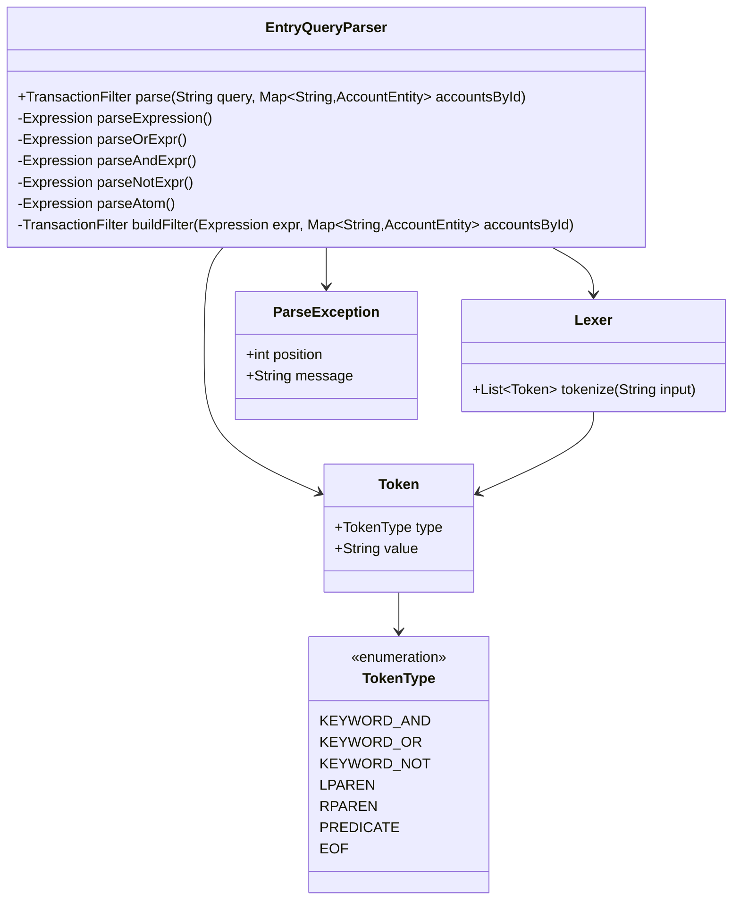
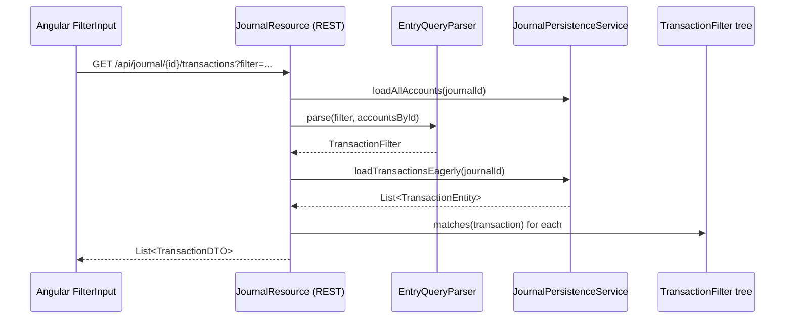

# Entry & Transaction Query Language

## Overview

The Entry Query Language (EQL) is a simple, human-readable filter language for searching transactions and their entries in the journal. It is inspired by SQL `WHERE` clauses and supports logical operators (`AND`, `OR`, `NOT`), grouping with parentheses, and a rich set of predicates covering every field of the data model.

The query string is passed as the `filter` query parameter to the `GET /api/journal/{journalId}/transactions` endpoint. The backend parses it into a tree of `TransactionFilter` objects and evaluates each transaction in memory against the resulting predicate.

---

## Grammar (EBNF)

```
query      ::= expression EOF

expression ::= or_expr

or_expr    ::= and_expr ( OR and_expr )*

and_expr   ::= not_expr ( AND not_expr )*

not_expr   ::= NOT not_expr
             | atom

atom       ::= '(' expression ')'
             | predicate

predicate  ::= date_pred
             | partner_pred
             | description_pred
             | commodity_pred
             | amount_pred
             | note_pred
             | tag_pred
             | account_type_pred
             | account_name_pred

date_pred        ::= 'date'   ':' date_op ':' date_value
date_op          ::= 'eq' | 'lt' | 'lte' | 'gt' | 'gte' | 'between'
date_value       ::= ISO_DATE ( '..' ISO_DATE )?   (* '..' only for 'between' *)

partner_pred     ::= 'partner' ':' match_value

description_pred ::= 'description' ':' match_value

commodity_pred   ::= 'commodity' ':' IDENTIFIER

amount_pred      ::= 'amount' ':' amount_op ':' decimal_value
amount_op        ::= 'eq' | 'lt' | 'lte' | 'gt' | 'gte'

note_pred        ::= 'note' ':' match_value

tag_pred         ::= 'tag' ':' match_value ( ':' match_value )?

account_type_pred ::= 'accounttype' ':' IDENTIFIER

account_name_pred ::= 'accountname' ':' match_value

match_value ::= QUOTED_STRING | REGEX_STRING | PLAIN_TOKEN
```

### Lexical definitions

| Token           | Pattern                                | Notes                                      |
|-----------------|----------------------------------------|--------------------------------------------|
| `ISO_DATE`      | `\d{4}-\d{2}-\d{2}`                   | e.g. `2024-01-31`                          |
| `DECIMAL`       | `-?\d+(\.\d+)?`                        | e.g. `-1234.50`                            |
| `IDENTIFIER`    | `[A-Za-z_][A-Za-z0-9_]*`              | case-insensitive for enum values           |
| `QUOTED_STRING` | `"…"` or `'…'`                        | Literal match (no wildcards), single value |
| `REGEX_STRING`  | `/…/` (optional trailing `i` flag)    | Java `Pattern` regex                       |
| `PLAIN_TOKEN`   | any non-whitespace non-`:()` chars    | `*` and `?` are glob wildcards             |
| `AND`           | keyword `AND` (case-insensitive)       | Also implied by whitespace between atoms   |
| `OR`            | keyword `OR` (case-insensitive)        |                                            |
| `NOT`           | keyword `NOT` (case-insensitive)       |                                            |

> **Implicit AND**: two adjacent atoms with only whitespace between them are treated as `AND`. This matches the behaviour users expect from a search box.

---

## Predicates Reference

### `date`

Filter by the transaction date.

| Syntax | Meaning |
|--------|---------|
| `date:eq:2024-01-31` | exactly that date |
| `date:gte:2024-01-01` | on or after |
| `date:lte:2024-12-31` | on or before |
| `date:gt:2024-01-01` | after (exclusive) |
| `date:lt:2024-12-31` | before (exclusive) |
| `date:between:2024-01-01..2024-12-31` | inclusive range |

### `partner`

Filter by partner ID (the part of the description after `|`).

| Syntax | Meaning |
|--------|---------|
| `partner:HOSTSTAR` | exact match (case-insensitive) |
| `partner:*STAR*` | glob wildcard |
| `partner:/host.*/i` | regex |

### `description`

Filter by transaction description (full description string, case-insensitive by default).

| Syntax | Meaning |
|--------|---------|
| `description:*invoice*` | contains "invoice" |
| `description:/^P\d+/` | starts with `P` followed by digits |
| `description:"Exact Text"` | exact literal match |

### `commodity`

Filter entries that use a specific commodity code (e.g. `CHF`, `USD`). A transaction matches if **any** of its entries uses the given commodity.

| Syntax | Meaning |
|--------|---------|
| `commodity:CHF` | any entry is in CHF |

### `amount`

Filter by entry amount. A transaction matches if **any** of its entries satisfies the condition.

| Syntax | Meaning |
|--------|---------|
| `amount:eq:100.00` | exactly 100.00 |
| `amount:gte:0` | non-negative amounts |
| `amount:lt:-50` | more negative than -50 |

### `note`

Filter by the note on an entry. A transaction matches if **any** of its entries has a note matching the value.

| Syntax | Meaning |
|--------|---------|
| `note:*receipt*` | note contains "receipt" |
| `note:/^ref:/i` | note starts with "ref:" |

### `tag`

Filter by tag key and optionally tag value attached to a transaction.

| Syntax | Meaning |
|--------|---------|
| `tag:invoice` | has tag key "invoice" |
| `tag:invoice:*34` | tag "invoice" value ends with "34" |
| `tag:/^Open.*/` | tag key matches regex |
| `tag:invoice:/PI\d+/` | tag "invoice" value matches regex |

### `accounttype`

Filter entries whose account is of a given type. A transaction matches if **any** entry's account type equals the value (case-insensitive).

Valid values: `ASSET`, `LIABILITY`, `EQUITY`, `REVENUE`, `EXPENSE`, `CASH`.

| Syntax | Meaning |
|--------|---------|
| `accounttype:EXPENSE` | any entry hits an Expense account |

### `accountname`

Filter by the **full hierarchical account path** (ancestor names joined with `:`, e.g. `"Assets:Current Assets:Cash"`). A transaction matches if **any** of its entries' account path satisfies the match.

| Syntax | Meaning |
|--------|---------|
| `accountname:*Bank*` | path contains "Bank" |
| `accountname:/Cash/i` | path contains "Cash" (regex) |
| `accountname:"Assets:Current Assets:Cash"` | exact path match |

---

## Logical Operators

| Operator | Behaviour |
|----------|-----------|
| `AND` (or whitespace) | Both sub-expressions must match |
| `OR` | Either sub-expression must match |
| `NOT` | Negates the following sub-expression |

Precedence (highest → lowest): `NOT` > `AND` > `OR`.

### Examples

```
date:gte:2024-01-01 date:lte:2024-12-31
```
Transactions in the year 2024 (implicit AND).

```
(tag:invoice OR tag:OpeningBalances) AND NOT accounttype:EQUITY
```
Transactions tagged as invoice or opening-balances that do not involve an equity account.

```
description:*hoststar* AND amount:lt:0
```
Hoststar transactions with at least one negative entry.

```
accountname:*Expenses:Marketing* AND date:between:2024-01-01..2024-06-30
```
Marketing expense entries in the first half of 2024.

```
tag:invoice:/PI\d{5}/ AND NOT partner:/test/i
```
Transactions with an invoice tag whose value looks like `PI12345`, excluding test partners.

---

## Match-value semantics

| Form | Example | Match rule |
|------|---------|-----------|
| Glob (plain token) | `*invoice*` | `*` = any chars, `?` = one char; case-insensitive |
| Quoted string | `"Exact Text"` | case-insensitive literal equality |
| Regex | `/pattern/` | Java `Pattern`, case-sensitive unless `i` flag appended |

A plain token without `*` or `?` is treated as a **case-insensitive exact match**.

---

## Architecture

### Class diagram



### Flow



> **Note:** For predicates that require account path resolution (`accountname`, `accounttype`) the parser receives the account map at parse time so it can pre-compute the set of matching account IDs for efficient in-memory evaluation.

---

## Error handling

If the query string cannot be parsed a `400 Bad Request` is returned with a JSON body:

```json
{
  "error": "query_parse_error",
  "message": "Unexpected token ')' at position 42",
  "position": 42
}
```

---

## Backward compatibility

The new query language replaces the old space-separated token syntax (`begin:`, `end:`, `not:`, bare tag keys). A compatibility shim in `JournalResource` detects the old syntax (no `AND`/`OR`/`NOT` keywords, no parentheses, no `date:`/`description:` etc.) and rewrites it to the new syntax so existing bookmarks continue to work.

Old → new mapping:

| Old token | New equivalent |
|-----------|---------------|
| `begin:20240101` | `date:gte:2024-01-01` |
| `end:20241231` | `date:lt:2024-12-31` |
| `partner:*ABC` | `partner:*ABC` |
| `not:invoice` | `NOT tag:invoice` |
| `invoice` (bare) | `tag:invoice` |
| `invoice:PI00001` | `tag:invoice:PI00001` |
