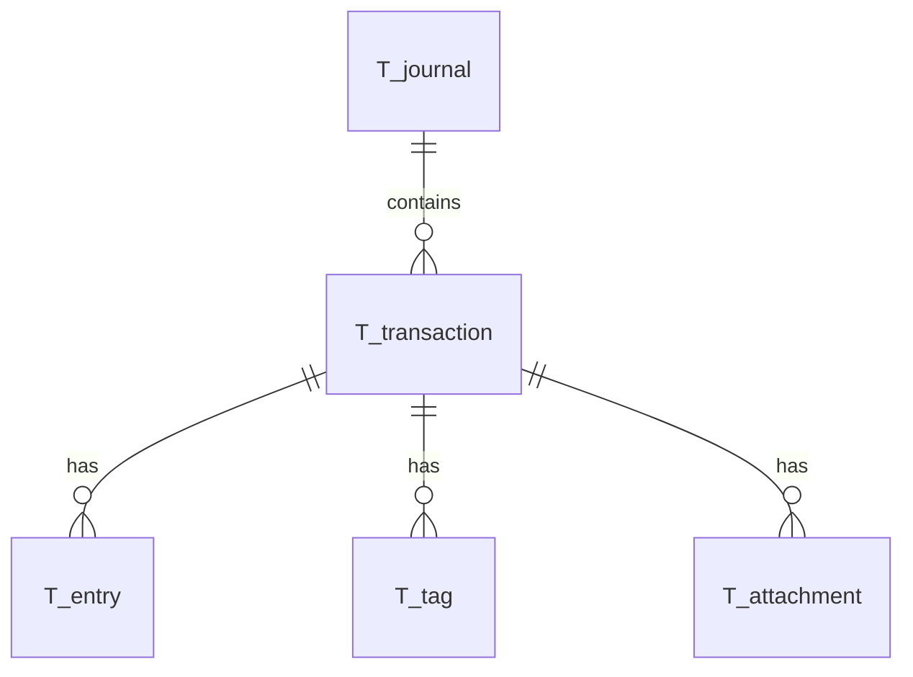
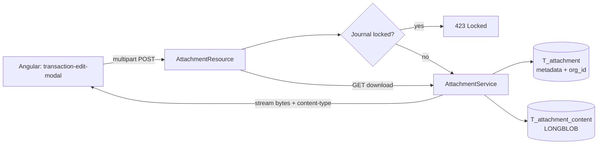

# Transaction Attachments (Receipts / PDFs) — Architecture Notes

Status: proposal / discussion document. Nothing described here is implemented yet.

## 1. Goal

Allow a user to attach one or more documents (primarily PDF receipts, but
photos of receipts are a realistic follow-up) to a `TransactionEntity`. Users
need to:

- Upload a document and link it to a transaction
- List the documents attached to a transaction
- View/download a document (render the PDF in the browser)
- Replace ("update") a document
- Delete a document
- Be blocked from uploading/replacing/deleting once the owning `JournalEntity`
  is `locked` (mirrors the existing transaction/account/macro locking rules)
- Never be able to see or reach another organisation's documents
  (multi-tenancy is discriminator-based, see
  `docs/HIBERNATE_DISCRIMINATOR_MULTITENANCY.md`)

## 2. Where this fits in the existing model



A new `T_attachment` table/entity, similar in spirit to `T_tag`: it belongs to
exactly one `TransactionEntity`, cascades with it, and — like every other
entity in this codebase — carries an `@TenantId org_id` column so Hibernate's
discriminator multi-tenancy applies automatically to it (see §5).

Per the entity-package `AGENTS.md` rule, the attachment **metadata** entity
lives in `entity/`, is not exposed to the UI directly, and is mapped to a
`AttachmentDTO` in `boundary/` for JSON transport. The **content** of the PDF
itself is a separate concern — see §3.

Suggested entity (metadata only, content stored separately regardless of
which storage strategy is chosen — see §3):

```java
@Entity
@Table(name = "T_attachment")
@Audited
public class AttachmentEntity {
    @Id
    @Column(length = 36)
    private String id;

    @Column(name = "transaction_id", nullable = false, length = 36)
    private String transactionId;

    @TenantId
    @Column(name = "org_id", nullable = false, updatable = false, length = 36)
    private String orgId;

    @Column(name = "file_name", nullable = false, length = 255)
    private String fileName;

    @Column(name = "content_type", nullable = false, length = 100)
    private String contentType; // e.g. application/pdf

    @Column(name = "size_bytes", nullable = false)
    private long sizeBytes;

    @Column(name = "sha256", length = 64)
    private String sha256; // integrity check / dedup opportunity

    @Column(name = "storage_key", nullable = false, length = 500)
    private String storageKey; // path or blob reference — see §3

    @Column(name = "uploaded_at", nullable = false)
    private Instant uploadedAt;

    @Column(name = "uploaded_by", length = 255)
    private String uploadedBy;
}
```

`transaction_id` is a plain FK (like `journal_id` on `TransactionEntity`)
rather than a managed `@ManyToOne`, consistent with this codebase's existing
style of avoiding loading the whole graph just to attach a child record
(`entity` package `AGENTS.md`).

## 3. Where to store the file content: CLOB/BLOB in MySQL vs filesystem vs object storage

This is the central architectural decision. Three realistic options, weighed
against this project's actual constraints: **native image (GraalVM), low
footprint (64MB RAM idle), containerised deployment, MySQL as the only
currently-provisioned stateful dependency, and no evidence of any volume/S3
infrastructure in this repo.**

### Option A — Store file bytes as a BLOB/LONGBLOB column in MySQL

Store the PDF bytes directly in a `LONGBLOB` column on `T_attachment` (or a
separate `T_attachment_content` table to avoid dragging large payloads through
every metadata query).

**Pros**
- Zero new infrastructure. MySQL is already a hard dependency of this app, so
  attachments come "for free" from an ops perspective — one database to back
  up, one connection pool, one thing to reason about.
- Multi-tenancy is *automatically* enforced by the exact same Hibernate
  discriminator mechanism already proven for every other entity (`@TenantId`,
  JPQL prepend of `org_id = ?`, etc. — see
  `docs/HIBERNATE_DISCRIMINATOR_MULTITENANCY.md`). There is no separate
  authorization surface to get wrong. This is a *significant* security
  advantage given the explicit "organisations must never see each other's
  documents" requirement — one mechanism, already audited, already tested,
  instead of a second one (filesystem paths / bucket keys) that a bug could
  bypass.
- Transactional consistency for free: inserting the attachment metadata and
  content happens in the same DB transaction as everything else. No
  orphaned files if a transaction is rolled back, no orphaned DB rows if a
  file write fails halfway.
- Works identically in dev, e2e (H2), and prod (MySQL) — the project's tests
  already run against H2 in `%e2e`/test profiles; a BLOB column needs no
  additional test doubles or fake filesystems.
- Backups "just work" — whatever backs up the MySQL database backs up the
  receipts too. There's no separate backup/retention policy for a
  filesystem or bucket to keep in sync with the DB.
- Fits the "native image, low footprint, no local state" philosophy called
  out in the README (idles at near-zero CPU/RAM) — the Quarkus process
  itself stays stateless, which also means it can be scaled horizontally /
  replaced / redeployed without needing a shared volume.

**Cons**
- MySQL `LONGBLOB` can hold up to 4GB per value, so *size itself* is not a
  concern for receipts (typically a few hundred KB to a few MB), but every
  byte inflates `mysqldump` output, binlog volume (especially with
  row-based replication), and buffer pool churn if queried carelessly.
  Mitigation: put content in its own table so listing/searching attachments
  never touches the BLOB column, and stream large values rather than
  loading them fully into a Java `byte[]` where avoidable.
- Read latency for serving a PDF back to the browser is a DB round-trip
  instead of a filesystem `sendfile()`/CDN hit. For rudimentary
  view/download of a handful of receipts per transaction this is
  irrelevant; would matter at very large scale.
- Growing the DB size can make MySQL backups/restores slower over time
  (though this is true of the accounting data itself too — it's already a
  system of record).

### Option B — Store files on local disk, path/filename recorded in MySQL

**Pros**
- Cheapest possible read path (plain file I/O), no BLOB serialization
  overhead.
- Keeps the row-store small; DB backups stay lean.

**Cons — and these are serious for this specific app**
- **Breaks the deployment model.** This app ships as a from-scratch native
  binary in a minimal container (`Dockerfile.native-micro`, UBI9 micro
  image) with no persistent volume configured anywhere in this repo.
  Containers are rebuilt/redeployed regularly (native image builds are a
  first-class workflow here, see `docs/NATIVE_IMAGE_BUILD.md`) — writing to
  the container's local filesystem means receipts vanish on redeploy/restart
  unless a persistent volume is provisioned and wired up out-of-band. That
  is new infrastructure this project does not currently have, and it is easy
  to get wrong (or forget) in a way that silently loses customer documents.
- **Multi-tenancy has to be reinvented and manually enforced.** Filesystem
  paths have no equivalent to Hibernate's automatic `@TenantId` filtering.
  Every single place that reads/writes/deletes a file must manually
  namespace by `orgId` (e.g. `/data/attachments/{orgId}/{transactionId}/{id}.pdf`)
  and must be scrupulously careful that a path is never constructed from
  unsanitized/unvalidated input (path traversal risk: `../../other-org/...`).
  Given the explicit requirement "it is imperative that organisations can
  only see their own documents", this is a materially higher-risk design
  than Option A, where tenant isolation is inherited automatically and has
  already been verified for every other entity in the system.
- No transactional coupling with the DB: a crash between "file written" and
  "DB row committed" (or vice versa) leaves an orphaned file or a DB row
  pointing at nothing. Requires reconciliation/cleanup jobs that don't exist
  today.
- Doesn't scale horizontally: if the app is ever run as more than one
  replica (or during a rolling deploy with two versions briefly overlapping),
  each replica needs the same shared volume, which reintroduces a
  distributed filesystem dependency (NFS/EFS/etc.) — one more moving part.
- Native-image compatibility isn't the blocker here (plain `java.nio.file`
  file I/O works fine in native images) — the blocker is purely
  operational/deployment (ephemeral storage, no volume, no tenant isolation
  for free).

### Option C — Object storage (S3-compatible: AWS S3, MinIO, Cloudflare R2, etc.)

**Pros**
- Purpose-built for exactly this (binary blobs with metadata), scales
  effectively without limit, cheap at scale, offloads bandwidth from the
  Quarkus process (can generate pre-signed URLs so the browser downloads
  directly from the bucket).
- Durable/replicated by the provider; no DB bloat.
- Works well with a stateless, horizontally-scalable, native-image
  deployment model — arguably the "correct" long-term answer for a SaaS
  product that will accumulate many large binary attachments over time
  (also opens the door to photos, bank statement PDFs, contracts, etc. in
  future).

**Cons**
- **New infrastructure dependency** that does not exist anywhere in this
  repo today (no S3/MinIO config, no bucket, no credentials management, no
  existing Quarkus extension for it in `pom.xml`). This is real,
  non-trivial setup and ops cost (bucket lifecycle policies, IAM/credentials
  handling — must not be logged/committed per this project's security
  rules, cost monitoring, an additional external dependency to mock during
  tests).
- Multi-tenancy again has to be manually and carefully enforced — an object
  key naming convention (e.g. `s3://bucket/{orgId}/{transactionId}/{id}.pdf`)
  plus, ideally, per-tenant IAM policies or bucket-key encryption — none of
  which is "free" the way the Hibernate discriminator is. Same class of risk
  as Option B, arguably slightly better if you invest in per-tenant
  prefixes + strict IAM, but that investment is real engineering work.
- Adds an external network call (with its own latency/failure modes,
  retries, and error handling) into what are currently simple, fully local
  DB transactions. Two-phase-commit-style problems reappear (object
  uploaded but DB insert fails, or vice versa) unless a reconciliation
  strategy or an outbox pattern is added.
- For "rudimentary" attachment management on receipts that are typically a
  few hundred KB, this is very likely premature — it solves a scaling
  problem this application does not have yet, at the cost of operational
  complexity it does not have today.

### Recommendation

**Go with Option A (BLOB column in MySQL), in a dedicated `T_attachment`
(metadata) + `T_attachment_content` (bytes) table pair.**

Rationale, specific to this codebase:
- It reuses the multi-tenancy mechanism that is already implemented, tested,
  and documented (`@TenantId` discriminator), rather than inventing a second,
  parallel authorization mechanism for a feature whose explicit hard
  requirement is tenant isolation. This is the single strongest argument —
  getting this wrong for financial documents (receipts, potentially
  containing personal/bank data) is a serious data-leak risk.
- It needs zero new infrastructure, fits the existing native-image /
  low-footprint / no-external-state philosophy of the project, and is
  trivially backed up/restored/replicated by whatever already backs up
  MySQL.
- It keeps every attachment operation inside the same JTA transaction as the
  transaction/journal-lock checks that already exist
  (`journalPersistenceService.requireNotLocked(...)`), so "can't attach a
  receipt to a locked journal" is enforced with the same pattern used
  everywhere else in this codebase, atomically.
- Receipt PDFs are small (typically well under a few MB); MySQL LONGBLOB
  comfortably handles this, and splitting content into its own table means
  ordinary transaction/attachment-list queries never pay the cost of the
  BLOB.

If/when the product grows to the point where attachments become large, high
volume (e.g. bulk photo uploads, video, very long retention with heavy
storage costs), *revisit* and consider migrating to Option C, at which point
the `storageKey` abstraction on `AttachmentEntity` (see below) makes that
migration additive rather than a rewrite: today `storageKey` can simply be
the ID used to look up the row in `T_attachment_content`; later it could
transparently become an object-storage key, gated behind a small
`AttachmentStorage` interface/service, without touching REST resources, DTOs,
or the Angular UI.



## 4. Suggested schema

```sql
CREATE TABLE T_attachment (
    id              VARCHAR(36)  NOT NULL PRIMARY KEY,
    transaction_id  VARCHAR(36)  NOT NULL,
    org_id          VARCHAR(36)  NOT NULL,
    file_name       VARCHAR(255) NOT NULL,
    content_type    VARCHAR(100) NOT NULL,
    size_bytes      BIGINT       NOT NULL,
    sha256          VARCHAR(64),
    uploaded_at     TIMESTAMP    NOT NULL DEFAULT CURRENT_TIMESTAMP,
    uploaded_by     VARCHAR(255),
    CONSTRAINT FK_attachment_transaction FOREIGN KEY (transaction_id) REFERENCES T_transaction (id)
);
CREATE INDEX I_attachment_transaction ON T_attachment (transaction_id);
CREATE INDEX I_attachment_org ON T_attachment (org_id);

-- kept separate so listing attachments never touches the blob
CREATE TABLE T_attachment_content (
    attachment_id VARCHAR(36) NOT NULL PRIMARY KEY,
    content       LONGBLOB    NOT NULL,
    CONSTRAINT FK_attachment_content_attachment FOREIGN KEY (attachment_id) REFERENCES T_attachment (id)
);
```

Both tables need an Envers `_AUD` counterpart if `@Audited` is used (follow
the pattern of `V01.021__createEnversAuditTables.sql`); note the existing
convention of *not* auditing the content table if the audit trail for binary
blobs isn't wanted (audit the metadata row only, i.e. don't put `@Audited` on
whatever entity/table maps `T_attachment_content`) — worth an explicit
decision, since auditing full binary content on every replace would multiply
storage. Recommend: audit metadata (who uploaded/replaced/deleted, when),
skip auditing raw bytes.

## 5. Multi-tenancy enforcement

Exactly the same discriminator approach as every other entity:

- `AttachmentEntity.orgId` is annotated `@TenantId` — Hibernate auto-populates
  it on persist and auto-filters `em.find`/JPQL by `org_id` (see
  `HIBERNATE_DISCRIMINATOR_MULTITENANCY.md`).
- Per that document's own "Potential risk" section, this codebase should
  continue to prefer **JPQL** for update/delete of attachments (always
  tenant-filtered) and always load via `em.find`/JPQL before mutating —
  exactly as `JournalPersistenceService`/`TransactionResource` already do.
  Do **not** build a raw `em.getReference(id)` from a client-supplied
  attachment ID and act on it directly — always load-then-check first, as
  the existing `findTransactionById(...).orElseThrow(...)` pattern does.
- The download endpoint is the highest-risk path (attacker enumerates
  attachment IDs to see if they can fetch someone else's receipt) — it must
  load the `AttachmentEntity` via `em.find`/a tenant-scoped query (never
  fetch raw bytes by ID via a query that bypasses the entity manager, e.g. a
  native SQL query joining only on `attachment_id` without `org_id`).
  Recommended pattern: `attachmentRepo.findById(id)` (tenant-filtered) →
  `404` if not found for this tenant (do **not** distinguish "not found" from
  "belongs to another org" in the response — always a plain 404, to avoid
  leaking existence of other orgs' data).
- `T_attachment_content` is intentionally *not* tenant-filtered itself (no
  `org_id` column) — it's always reached exclusively through the tenant-
  filtered `T_attachment` row (`attachment_id` FK), never queried directly
  from user input. This keeps the security-critical check in exactly one
  place, per the existing pattern of encapsulating everything through
  `JournalPersistenceService`.

## 6. Locking rules

Mirror `journalPersistenceService.requireNotLocked(journalId)` exactly as
`TransactionResource` does today for create/update:

- **Upload** (attach a new document to a transaction): blocked if the
  transaction's journal is locked.
- **Replace/update** an existing attachment: blocked if locked.
- **Delete**: blocked if locked.
- **View/download/list**: always allowed regardless of lock state (locking
  protects against *mutation*, not read access — consistent with how locked
  journals still allow viewing transactions).

This requires resolving `transactionId → journalId` before the lock check,
same as `TransactionResource.updateTransaction` does via
`journalPersistenceService.findTransactionById(...).getJournalId()`.

## 7. REST API sketch

Following this project's existing resource conventions
(`@RolesAllowed({Roles.USER})`, `JournalLockedExceptionMapper` → HTTP 423):

```
POST   /api/transaction/{transactionId}/attachment      multipart/form-data upload, returns AttachmentDTO
GET    /api/transaction/{transactionId}/attachment       list AttachmentDTO (metadata only, no bytes)
GET    /api/attachment/{attachmentId}                     download raw bytes (Content-Type from stored contentType,
                                                            Content-Disposition: inline; filename="...")
PUT    /api/attachment/{attachmentId}                     replace content (multipart), 423 if journal locked
DELETE /api/attachment/{attachmentId}                     delete, 423 if journal locked
```

Notes:
- `quarkus-rest` (RESTEasy Reactive) supports `multipart/form-data` via
  `@RestForm`/`MultipartFormDataInput`-style POJOs out of the box — no new
  Maven dependency should be needed beyond what's already in `pom.xml`
  (verify against the exact Quarkus 3.31 API when implementing).
- Enforce a maximum upload size (e.g. 10–20MB) and a strict content-type
  allow-list (`application/pdf` at minimum; consider `image/png`,
  `image/jpeg` for photographed receipts) both client- and server-side.
  Never trust the client-supplied `Content-Type` alone — sniff/validate
  magic bytes server-side (e.g. `%PDF-` header) before accepting, to avoid
  someone uploading an executable disguised as a PDF.
- `DELETE`/`PUT` must re-validate tenant ownership (see §5) before the lock
  check, so a cross-tenant probe gets a 404, not a 423 (which would leak
  that the transaction/attachment exists at all).

## 8. Frontend sketch (Angular)

- Extend `TransactionEditModalComponent` (see
  `transaction-edit-modal.component.spec.ts`) with an "Attachments" section:
  file `<input type="file" accept="application/pdf">`, an upload button, and
  a list of already-attached documents (filename, size, uploaded date).
- Each list item: "View" (open `GET /api/attachment/{id}` in a new tab or an
  in-app PDF viewer — `<embed>`/`<iframe>` pointing at the endpoint, or use
  `pdf.js` if a richer in-app viewer is wanted later), "Replace", "Delete".
  Replace/Delete buttons disabled (or hidden) when `journal.locked` is true,
  mirroring how other locked-journal UI affordances presumably already
  behave elsewhere in this app.
- New attachments on a **not-yet-saved** (new) transaction: either (a)
  disable attachment upload until the transaction is first saved and has an
  ID, or (b) stage files client-side and upload them right after
  `createTransaction()` succeeds. Given `isNew` handling already visible in
  the spec file, (a) is simplest and least risky to implement first.

## 9. Testing

Consistent with this project's testing rules (`overview.md`): attachment
CRUD + tenant isolation + locking must be covered by `@QuarkusTest`
integration tests, e.g.:

- `AttachmentResourceTest`: upload/list/download/replace/delete happy paths.
- A cross-tenant test proving org A cannot download/replace/delete org B's
  attachment (404, not 200/403) — this is the most important test in this
  feature given the explicit requirement.
- A locking test (parallel to `JournalLockingTest`) proving upload/replace/
  delete are rejected with 423 on a locked journal, while list/download
  still succeed.
- Reject non-PDF/oversized/malformed uploads.

## 10. Decisions

### 10.1 Cardinality: many attachments per transaction

**Decided: 1..n.** A transaction can have zero or more attachments. This is
already reflected in the schema (§4: `T_attachment.transaction_id` is a plain
FK, no uniqueness constraint) and the REST sketch (§7:
`POST/GET /api/transaction/{transactionId}/attachment` — a collection, not a
singleton resource). No changes needed to the design above; noted here for
clarity since it was originally an open question.

### 10.2 Bulk export: "download all as zip"

**Decided: yes**, as a follow-up once basic CRUD (§7) is in place. Two useful
scopes, both worth exposing:

- **Per transaction** — `GET /api/transaction/{transactionId}/attachments.zip`
  — all receipts for one transaction. Handy when a transaction has several
  attachments (e.g. an invoice + a proof-of-payment).
- **Per journal + date range** — `GET /api/journal/{journalId}/attachments.zip?from=YYYY-MM-DD&to=YYYY-MM-DD`
  — every attachment for every transaction in that journal whose
  `transactionDate` falls in the range. This is the one that matters most
  for "handing receipts to an accountant/auditor at year end": it lets a
  user export a whole fiscal year's worth of receipts in one request,
  mirroring the existing `previousJournalId` fiscal-year chaining already
  present on `JournalEntity`.

**Implementation approach:**

- New endpoint(s) in a small `AttachmentExportResource` (or a method on the
  existing `AttachmentResource`/`JournalResource`, whichever fits better once
  those classes exist), `@RolesAllowed({Roles.USER})`, tenant-scoped exactly
  like every other read: resolve the journal/transactions via the existing
  tenant-filtered `JournalPersistenceService` queries first, then only ever
  fetch attachment content for transaction IDs that came out of that
  tenant-filtered set. Never accept a raw list of attachment IDs from the
  client for a bulk export — always derive the set server-side from
  `journalId` (+ optional date range), so there is no way to smuggle another
  org's attachment ID into a batch request.
- Stream the response: write a `application/zip` body incrementally using
  `java.util.zip.ZipOutputStream` directly onto the JAX-RS
  `StreamingOutput`/`Response` output stream, reading each attachment's bytes
  from `T_attachment_content` one at a time (open one BLOB, write one
  `ZipEntry`, close, move to next). This avoids holding the whole export in
  memory at once — important given the project's "low footprint / 64MB RAM"
  design goal (README §"Things to remember"). `java.util.zip` is part of the
  JDK and is native-image-safe (routinely used in Quarkus native builds).
- Name each zip entry meaningfully and deterministically, e.g.
  `{transactionDate}_{transactionId short}_{originalFileName}`, so an
  accountant can make sense of the archive contents without reopening the
  app; avoid collisions by disambiguating duplicate file names within the
  same zip (append `_2`, `_3`, ... on repeats).
- For the per-journal/date-range variant, consider adding a size/count guard
  (e.g. reject or warn above N attachments / M total MB) so a very large
  journal can't produce an export that runs the process out of memory or
  ties up a request thread for an excessive time; a simple upper bound is
  sufficient for a first version — genuine pagination/async job handling can
  wait until there's evidence it's needed.
- UI: a "Download all receipts" button on the journal/reports area (date
  range defaulting to the fiscal year already associated with the journal),
  and a smaller "Download all" link within the attachments section of
  `TransactionEditModalComponent` for the single-transaction case.
- Testing: an integration test proving the per-journal export only contains
  attachments belonging to the requesting org's own transactions, even when
  another org's journal has overlapping transaction dates — this is the
  bulk-export equivalent of the single-attachment cross-tenant test in §9,
  and arguably more important here since a bulk endpoint aggregates more
  data per request and is thus a juicier target for a tenant-isolation bug.

## 11. Open questions for follow-up

- Virus/malware scanning on upload — out of scope for a "rudimentary" first
  version, but worth flagging for a production rollout given files come
  from end users. See the discussion of scanning options and how they'd fit
  the `Dockerfile.native-micro` deployment model in the accompanying chat
  response (not duplicated here to avoid this doc drifting out of date with
  the actual chosen approach at implementation time).
  - **Is there real risk given same-org-only access, inline browser
    viewing, and a `.pdf` extension?** Yes — those three constraints reduce
    but do not eliminate the risk, for several reasons:
    - **The PDF format itself is executable content, not inert data.** The
      PDF spec supports embedded JavaScript, "launch actions" (open a URI or
      external command), and embedded files/objects. A file can be a
      100%-valid, correctly-`%PDF`-signed PDF (i.e. it passes the magic-byte
      check from §7) and still carry a malicious payload — this has nothing
      to do with the file extension or renaming tricks. Magic-byte/
      content-type validation only proves "this is a real PDF", not "this
      PDF is safe". A malware scanner (which inspects for known-malicious
      *content*, not just container format) is a materially different,
      complementary control.
    - **"Viewed in the browser" is a mitigation, not a guarantee.**
      Browsers' built-in PDF renderers (Chrome/Chromium's PDFium, Firefox's
      `pdf.js`) are far more sandboxed than standalone desktop readers, but
      both have had real, exploitable CVEs over the years (memory
      corruption bugs that led to remote code execution in some cases).
      Rendering untrusted PDFs client-side is safer than shelling out to
      Adobe Acrobat, but "safer" ≠ "safe". A user is also free to download
      the file (this feature explicitly requires that ability) and open it
      in a separate desktop PDF reader with a worse security track record.
    - **"Same organisation" is a weaker trust boundary than it sounds.**
      This feature's tenant isolation stops *other organisations'* users
      from ever reaching the file — that part is solid (§5). But it does
      nothing to stop:
      - a **compromised or phished account** within the org from uploading
        a booby-trapped receipt for legitimate coworkers to open (classic
        lateral-movement / initial-access pattern — attacker doesn't need
        to breach the app, just one employee's credentials);
      - a **malicious or careless insider** uploading something harmful on
        purpose or by mistake (e.g. a receipt photo/PDF picked up from a
        public email attachment that was itself infected before it ever
        reached this app);
      - the natural, already-designed **export path leaving the org
        boundary entirely** — §10.2's own "download all as zip for your
        accountant/auditor" feature means these files are expected to be
        forwarded to *external* recipients. A scan-free upload path means
        this app could become the mechanism by which an infected file
        reaches a third party (the accountant), which is a worse look than
        "we got infected" — it's "we infected someone else".
    - **Net assessment:** the three stated constraints meaningfully shrink
      the *blast radius* (compared to, say, a public file-sharing feature)
      but they do not reduce the risk to zero, because the attack surface
      here is "a human opens a file they were sent by a nominally-trusted
      but not-necessarily-uncompromised colleague or the app itself" —
      exactly the scenario malware scanning exists to catch. It's
      reasonable to ship without it for a first, rudimentary internal
      version, but it should be treated as a real gap to close before
      actively encouraging external sharing/export, not merely a
      theoretical box-ticking exercise.
