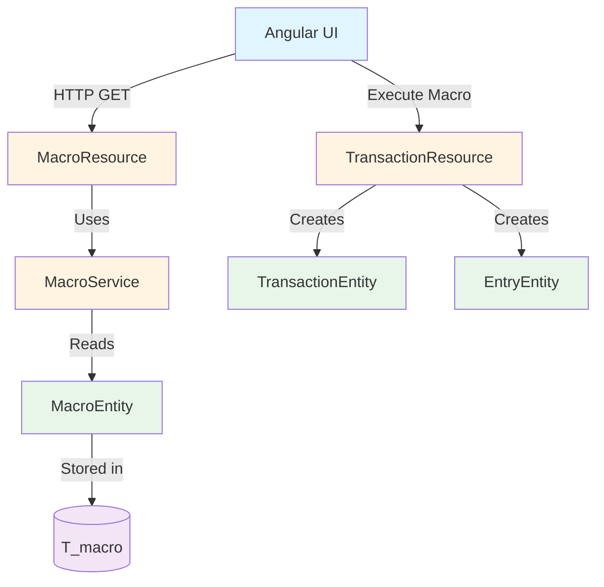
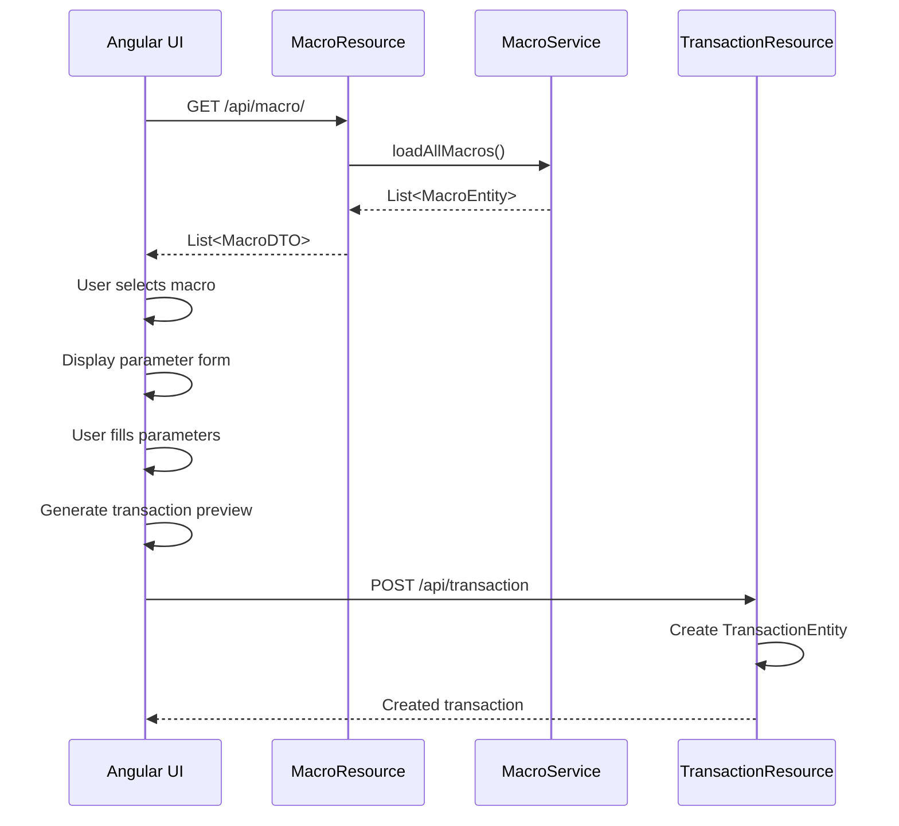

# Macro System Design

## Overview

The macro system allows users to define reusable transaction templates that can be executed through the Angular web interface. Macros simplify common accounting tasks like paying bills, recording recurring transactions, and performing year-end operations.

## Architecture



## Database Schema

### T_macro Table

```sql
CREATE TABLE T_macro (
    id VARCHAR(36) PRIMARY KEY,
    journal_id VARCHAR(36) NOT NULL,
    name VARCHAR(100) NOT NULL,
    description VARCHAR(500) NOT NULL,
    parameters TEXT NOT NULL,  -- JSON array of parameter definitions
    template TEXT NOT NULL,    -- Transaction template with placeholders
    validation TEXT,           -- JSON object with validation rules
    notes TEXT,               -- Additional notes/documentation
    created_date TIMESTAMP NOT NULL,
    modified_date TIMESTAMP NOT NULL,
    CONSTRAINT FK_macro_journal FOREIGN KEY (journal_id) 
        REFERENCES T_journal(id) ON DELETE CASCADE
);

CREATE INDEX I_macro_journal ON T_macro(journal_id);
CREATE INDEX I_macro_name ON T_macro(name);
```

## Data Model

### MacroEntity (JPA Entity)

```java
@Entity
@Table(name = "T_macro")
public class MacroEntity {
    @Id
    private String id;
    
    @Column(nullable = false, length = 100)
    private String name;
    
    @Column(nullable = false, length = 500)
    private String description;
    
    @Column(nullable = false, columnDefinition = "TEXT")
    private String parameters;  // JSON
    
    @Column(nullable = false, columnDefinition = "TEXT")
    private String template;
    
    @Column(columnDefinition = "TEXT")
    private String validation;  // JSON
    
    @Column(columnDefinition = "TEXT")
    private String notes;
    
    @Column(name = "created_date", nullable = false)
    private LocalDateTime createdDate;
    
    @Column(name = "modified_date", nullable = false)
    private LocalDateTime modifiedDate;
}
```

### MacroDTO (REST API)

```java
public record MacroDTO(
    String id,
    String name,
    String description,
    List<MacroParameterDTO> parameters,
    String template,
    MacroValidationDTO validation,
    String notes,
    String createdDate,
    String modifiedDate
) {}

public record MacroParameterDTO(
    String name,
    String type,  // account, amount, text, date, partner, code, status
    String prompt,
    String defaultValue,
    boolean required,
    String filter  // For account type filtering
) {}

public record MacroValidationDTO(
    boolean balanceCheck,
    Integer minPostings
) {}
```

## Parameter Types

| Type | Description | UI Component | Validation |
|------|-------------|--------------|------------|
| `date` | Date in YYYY-MM-DD | Date picker | Valid date |
| `partner` | Partner name | Dropdown from partners | Non-empty |
| `code` | Transaction code | Text input | Optional |
| `amount` | Monetary amount | Number input | Positive number |
| `text` | Free text | Text input | Non-empty if required |
| `account` | Account selector | Dropdown with filter | Valid account ID |
| `status` | Transaction status | Dropdown (*, !, empty) | Valid status |

## Template Processing

### Template Syntax

Templates use `{placeholder}` syntax for parameter substitution:

```
{date} * {partner} | {description}
    ; id:{id}
    ; invoice:{invoice_number}
    {expense_account}        CHF {amount}
    {bank_account}           CHF -{amount}
```

### Built-in Variables

| Variable | Description | Example |
|----------|-------------|---------|
| `{today}` | Current date | `2024-11-09` |
| `{year}` | Current year | `2024` |
| `{month}` | Current month | `11` |
| `{day}` | Current day | `09` |

### Template Processing Flow



## Service Layer

### MacroService

```java
@ApplicationScoped
public class MacroService {
    
    @PersistenceContext
    EntityManager em;
    
    @Transactional
    public List<MacroEntity> loadAllMacros();
    
    @Transactional
    public MacroEntity loadMacro(String macroId);
    
    @Transactional
    public MacroEntity createMacro(MacroEntity macro);
    
    @Transactional
    public MacroEntity updateMacro(MacroEntity macro);
    
    @Transactional
    public void deleteMacro(String macroId);
}
```

## REST API

### MacroResource

```java
@Path("/api/macro")
@Produces(MediaType.APPLICATION_JSON)
@RolesAllowed({Roles.USER})
public class MacroResource {
    
    @GET
    public List<MacroDTO> getAllMacros();
    
    @GET
    @Path("/macro/{macroId}")
    public MacroDTO getMacro(
        @PathParam("macroId") String macroId);
    
    @POST
    @Consumes(MediaType.APPLICATION_JSON)
    public MacroDTO createMacro(MacroDTO macro);
    
    @PUT
    @Path("/macro/{macroId}")
    @Consumes(MediaType.APPLICATION_JSON)
    public MacroDTO updateMacro(
        @PathParam("macroId") String macroId,
        MacroDTO macro);
    
    @DELETE
    @Path("/macro/{macroId}")
    public void deleteMacro(
        @PathParam("macroId") String macroId);
}
```

## JSON Storage Format

### Parameters Field

```json
[
  {
    "name": "date",
    "type": "date",
    "prompt": "Transaction date",
    "defaultValue": "{today}",
    "required": true
  },
  {
    "name": "partner",
    "type": "partner",
    "prompt": "Partner (supplier)",
    "required": true
  },
  {
    "name": "amount",
    "type": "amount",
    "prompt": "Amount (e.g., 100.50)",
    "required": true
  },
  {
    "name": "expense_account",
    "type": "account",
    "prompt": "Expense account (6..)",
    "filter": "^6.*:.*$",
    "required": true
  }
]
```

### Validation Field

```json
{
  "balanceCheck": true,
  "minPostings": 2
}
```

## UI Integration

### Macro Execution Flow

1. **User selects macro** from dropdown
2. **System displays form** with all required parameters
   - Date parameters default to `{today}` if specified
   - Account parameters show filtered dropdown
   - Partner parameters show partner dropdown
3. **User fills in parameters** with client-side validation
4. **System generates transaction preview** by substituting placeholders
5. **User reviews** generated transaction
6. **User confirms** and transaction is created via existing TransactionResource

### Angular Components

- `MacroSelectorComponent` - Dropdown to select macro
- `MacroFormComponent` - Dynamic form based on macro parameters
- `MacroPreviewComponent` - Preview generated transaction before creation

## Security Considerations

1. **Authorization**: Only users with `Roles.USER` can access macros
2. **Journal isolation**: Macros are scoped to journals, enforced by foreign key
3. **Validation**: All parameters validated before transaction creation
4. **Balance checks**: Transactions must balance unless explicitly disabled
5. **Account verification**: Only existing accounts can be referenced
6. **Audit trail**: All macro executions logged via transaction creation

## Example Macros

See `V01.013__insertStandardMacros.sql` for pre-loaded macro examples including:

- **PaymentByStaff** - Staff member pays expense with personal funds
- **RepayStaff** - Reimburse staff member for expenses
- **BankingExpense** - Record bank fees and charges
- **PayInvoiceFromBank** - Pay supplier invoice from bank account
- **PaymentForGoods** - Purchase inventory for resale
- **InvoiceForServicesOrSaas** - Send customer invoice
- **CustomerPaysInvoice** - Record customer payment
- **InventoryAdjustment** - Year-end inventory write-down
- **RecordDepreciation** - Annual depreciation entry
- **TaxProvision** - Year-end tax provision
- **TaxPayment** - Pay provisioned taxes with adjustment
- **LegalReserveAllocation** - Mandatory 5% profit allocation (Swiss Sàrl)

## Testing Strategy

### Unit Tests

- `MacroEntityTest` - Test entity creation and validation
- `MacroServiceTest` - Test service methods with in-memory database

### Integration Tests

- `MacroResourceTest` - Test REST endpoints with `@QuarkusTest`
  - GET all macros for journal
  - GET single macro by ID
  - POST create new macro
  - PUT update existing macro
  - DELETE macro
  - Verify journal isolation
  - Verify authorization

### Coverage Goals

- **Statement coverage**: 80%+
- **Branch coverage**: 70%+

## Future Enhancements

1. **Template validation** - Validate template syntax before saving
2. **Macro versioning** - Track changes to macro definitions
3. **Macro sharing** - Export/import macros between journals
4. **Conditional logic** - Support `{if}` statements in templates
5. **Loops** - Support `{for}` loops for split transactions
6. **Macro marketplace** - Share macros with community
7. **Scheduled execution** - Recurring macro execution
8. **Batch execution** - Execute multiple macros at once

## Migration Path

1. Create `T_macro` table via Flyway migration
2. Insert standard macros via data migration
3. Deploy backend with MacroEntity, MacroService, MacroResource
4. Update Angular UI to support macro selection and execution
5. Test with existing journals

## Dependencies

- **Quarkus extensions**: hibernate-orm, flyway, jdbc-mysql, rest-jackson, oidc
- **Java version**: 21 (native image compatible)
- **Database**: MySQL 8.0+
- **Frontend**: Angular with TypeScript

## Notes

- Macros are **read-only templates** - they don't execute directly
- The Angular UI generates transactions from macro templates
- Transactions are created via existing `TransactionResource` endpoints
- This design maintains separation between macro definitions and transaction execution
- All transaction validation rules still apply
