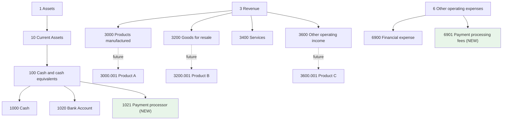
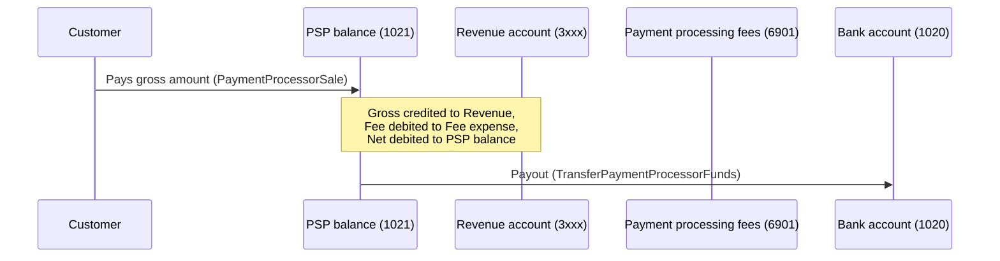

# Online Payment Processor Integration Design

## Status

**DRAFT — for review only. No code, migration, or export-file changes have been made yet.**

## Scope

Add support for recording sales made through an online payment processor / payment service
provider (PSP) such as Stripe, PayPal, Square, or Adyen.

This covers:

1. A new cash account `1021 Payment processor` for funds held by the PSP.
2. A new expense account `6901 Payment processing fees` for PSP charges.
3. A macro `PaymentProcessorSale` that records one transaction per sale: gross revenue,
   PSP fee, and net amount held by the PSP.
4. A macro `TransferPaymentProcessorFunds` for manually recording PSP payouts to a bank
   account.
5. A batch macro execution mode so a reviewed set of PSP payments can be pasted into
   abstraccount and converted into transactions at once.

## Workflow

Webhooks are **not** received directly by abstraccount. A separate application receives the
PSP webhooks, waits for the complete fee data, lets the user review the payments, and exports
them as a batch. The user pastes the batch into abstraccount, which creates one
transaction per payment.

Reasons:

- **Journal choice:** the external app does not know which abstraccount journal to use.
- **Year-end control:** the user decides when to import, avoiding automatic posts during
  closing.
- **Review:** fees, exchange rates, refunds, and disputes can be checked first.
- **Complete fee data:** PSPs (e.g. Stripe) split data across events
  (`payment_intent.succeeded`, then `charge.updated` once the `balance_transaction` is
  available). The external app waits for the full data before export.
- **Partner numbers:** the external app can look up the proper abstraccount partner number
  (e.g. `P00000001` from `PartnerDataAdapter`) and pass it directly.

Payouts are handled manually with `TransferPaymentProcessorFunds`.

## Chart of accounts changes

Only for **newly created journals** via `JournalCreationService`. Existing journals must add
the accounts manually through the UI if needed.

### `1021 Payment processor` (new CASH account)

Sibling of `1020 Bank Account`, child of `100 Cash and cash equivalents`.

| Field | Value |
|---|---|
| Name | `1021 Payment processor` |
| Type | `CASH` |
| Parent | `100 Cash and cash equivalents` |
| Note | Funds held by a PSP after a sale, before payout to the company's bank account. Examples: Stripe, PayPal, Square, Adyen. |
| Code path | `1:10:100:1021` |

### `6901 Payment processing fees` (new EXPENSE account)

Sibling of `6900 Financial expense`, child of `6 Other operating expenses`.

| Field | Value |
|---|---|
| Name | `6901 Payment processing fees` |
| Type | `EXPENSE` |
| Parent | `6 Other operating expenses` |
| Note | Fees charged by PSPs on card/online payments. Kept separate from bank charges in `6900`. |
| Code path | `6:6901` |

### Revenue accounts

No new revenue account is created. The macro lets the user pick any existing account under
the `3` family (e.g. `3000`, `3200`, `3400`, `3600`, or future sub-accounts like
`3600.001`).

Macro filter regex:

```
^3:.*$
```

### Chart-of-accounts diagram



## Macro 1: `PaymentProcessorSale`

Records a single PSP sale as a three-legged transaction.

**Accounting:**
- Debit `1021 Payment processor` for the net amount (`gross - fee`).
- Debit `6901 Payment processing fees` for the PSP fee.
- Credit the selected revenue account for the gross amount.

**Parameters:**

| Name | Type | Prompt | Filter |
|---|---|---|---|
| `date` | date | Transaction date | — |
| `partner` | partner | Partner (customer), optional | — |
| `description` | text | Description | — |
| `gross_amount` | amount | Gross amount charged | — |
| `fee_amount` | amount | PSP fee (may be 0) | — |
| `stripe_txn` | code | PSP transaction code (`pi_...`, `ch_...`, `txn_...`) | — |
| `contract_id` | code | Internal contract / order id | — |
| `revenue_account` | account | Revenue account | `^3:.*$` |
| `fee_expense_account` | account | Fee expense account | `^6.*:6901.*$` |
| `processor_account` | account | PSP balance account | `^1.*:10.*:100.*:1021.*$` |

**Template:**

```
{date} * {partner} | {description}
    ; stripe_txn:{stripe_txn}, contract_id:{contract_id}
    {processor_account}       {default_currency} {gross_amount - fee_amount}
    {fee_expense_account}     {default_currency} {fee_amount}
    {revenue_account}         {default_currency} -{gross_amount}
```

**Validation:** `{"balanceCheck":true,"minPostings":3}`

## Macro 2: `TransferPaymentProcessorFunds`

Records a PSP payout to any cash account.

**Parameters:**

| Name | Type | Prompt | Filter |
|---|---|---|---|
| `date` | date | Transfer date | — |
| `description` | text | Description | — |
| `amount` | amount | Amount transferred | — |
| `processor_account` | account | PSP balance account (source) | `^1.*:10.*:100.*:1021.*$` |
| `cash_account` | account | Destination cash account | `^1.*:10.*:100.*:10[0-9][0-9].*$` |

**Template:**

```
{date} * Payment processor payout | {description}
    ; Payment:
    {cash_account}       {default_currency} {amount}
    {processor_account}      {default_currency} -{amount}
```

**Validation:** `{"balanceCheck":true,"minPostings":2}`

### Macro flow



## Batch macro execution

The current macro system creates one transaction per execution. For PSP sales, the user will
paste a batch of reviewed payments and abstraccount will execute the same macro once per row.

### Shared and per-row parameters

Shared parameters are filled once for the whole batch:

- `revenue_account`
- `fee_expense_account`
- `processor_account`

Per-row parameters come from the pasted data (one row per payment):

- `date`
- `partner`
- `description`
- `gross_amount`
- `fee_amount`
- `stripe_txn`
- `contract_id`

### CSV format

The external app exports a CSV file with one row per payment:

```csv
date,partner,description,gross_amount,fee_amount,stripe_txn,contract_id
2025-08-09,P00000001,Widget sale,100.00,5.00,pi_3Mtwxxxx,C-12345
2025-08-09,P00000002,Gadget sale,250.00,7.50,pi_3Mtwyyyy,C-12346
```

The header is optional. Comma is the delimiter.

### Execution behaviour

There is no preview step. Submitting the batch (shared parameters + CSV) creates transactions
directly, one per row, in a single request to the batch endpoint.

Rows are processed independently:

- Valid rows are posted as transactions.
- Invalid rows (e.g. bad date, non-existent account, unbalanced amounts) are skipped.
- The response is a partial result: it lists which rows succeeded and which failed, with a
  warning message per failed row (row number/identifying data + reason), so the user can fix
  and resubmit just those rows.

### Tags

Each generated transaction is tagged with the PSP transaction code and an internal contract
id, replacing the invoice number used by other macros:

```
    ; stripe_txn:{stripe_txn}, contract_id:{contract_id}
```

These tags are stored in `T_tag` and can be used for reconciliation and reporting.

### Backward compatibility

Existing macros keep working as single-execution macros. Batch mode is an additional option.

## Files that will need to change

1. `src/main/java/dev/abstratium/abstraccount/service/JournalCreationService.java`
   — add `1021 Payment processor` and `6901 Payment processing fees` to the starter chart;
   ensure standard revenue accounts (`3000`, `3200`, `3400`, `3600`) are present.
2. `src/main/resources/db/migration/V01.024__insertPaymentProcessorMacros.sql`
   — insert `PaymentProcessorSale` and `TransferPaymentProcessorFunds` into `T_macro`.
3. `src/main/webui/public/builtin/macros-export.yaml` — add the two macros for import into
   existing journals.
4. `src/main/java/dev/abstratium/abstraccount/boundary/MacroResource.java` — add a batch
   execution endpoint (e.g. `POST /api/macro/execute-batch`).
5. `src/main/java/dev/abstratium/abstraccount/service/MacroService.java` — support batch
   template evaluation.
6. `src/main/webui/src/app/macros/macros.component.ts` and its HTML template — add batch mode
   UI with shared parameters, CSV textarea, parsing, and display of the per-row results
   (successes and warnings) returned by the batch endpoint.
7. Tests — unit and integration tests for the new accounts, macros, and batch execution
   (including partial-failure scenarios).
8. `docs/ephemeral-and-volatile-and-temporary-but-interesting/MACRO_SYSTEM.md` — update the
   example macro list and document the new batch execution mode.

Reports are expected to work without changes because `1021` is matched by `CASH`, revenue
accounts by `REVENUE`, and `6901` by `EXPENSE`.

## Decisions recorded

| Question | Decision |
|---|---|
| `1021` name | `1021 Payment processor` |
| Retro-fit accounts to existing journals? | **No** |
| Generic or Stripe-specific? | Generic (`PaymentProcessorSale`, `TransferPaymentProcessorFunds`) |
| `partner` in sale macro | **Optional**; if empty, the generated header has no payee |
| `fee_amount` can be zero? | **Yes** |
| Webhooks in abstraccount? | **No** — received and reviewed in a separate app |
| Recording payments | Batch macro execution, one transaction per sale |
| Reference for each sale | Tags `stripe_txn` and `contract_id`; no invoice number |
| Partner number source | Passed directly from external app as abstraccount partner number |
| Revenue account per batch | User chooses once per product batch |
| Payouts | Manual `TransferPaymentProcessorFunds` macro |
| Batch input format | CSV as primary format |
| CSV delimiter | Comma |
| Batch UI preview before creation? | **No** — transactions are created directly |
| Batch endpoint behaviour | Creates all transactions in one request (no separate preview step) |
| Invalid row handling | Create a partial result: valid rows are posted, invalid rows are skipped and reported as warnings identifying which rows failed and why |

## References

- Stripe webhooks documentation (Java): <https://docs.stripe.com/webhooks.md?lang=java>
